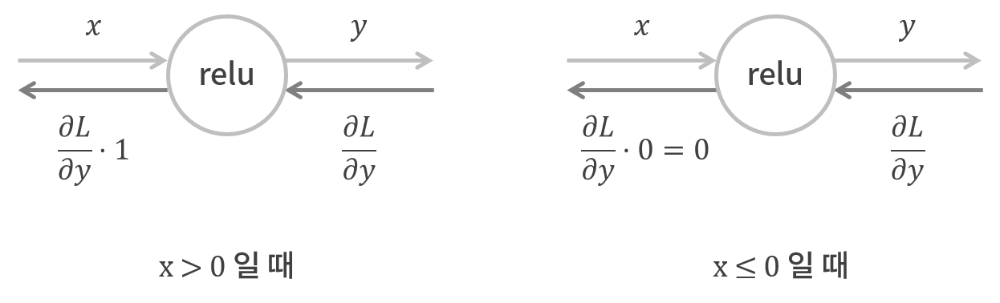
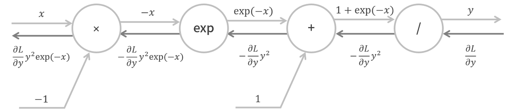
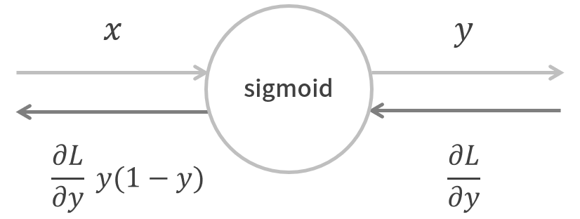
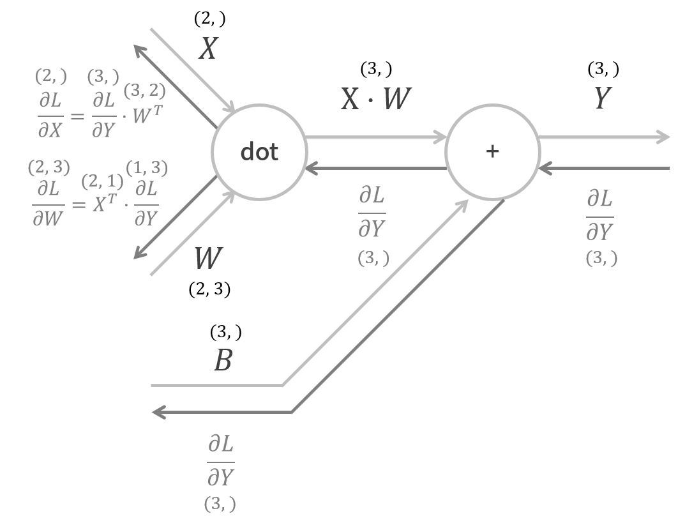
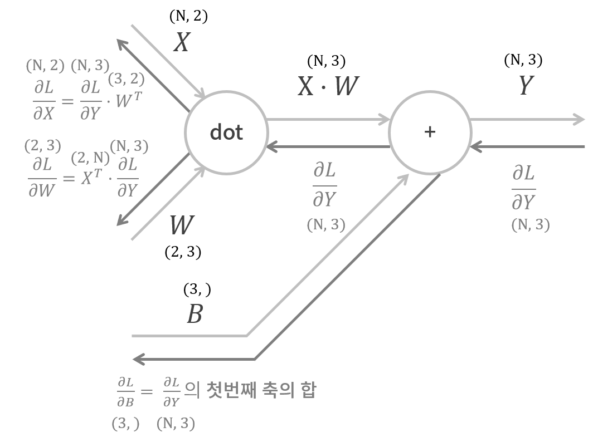
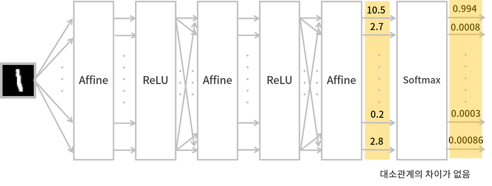
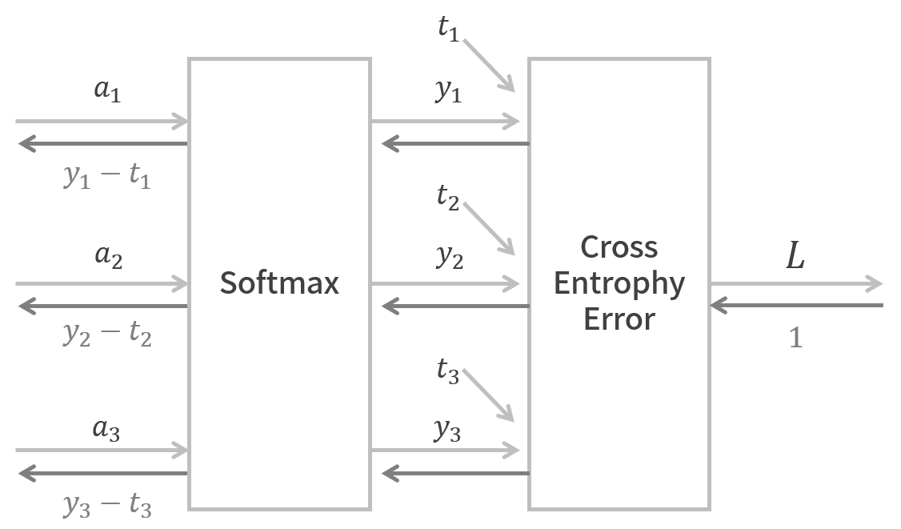
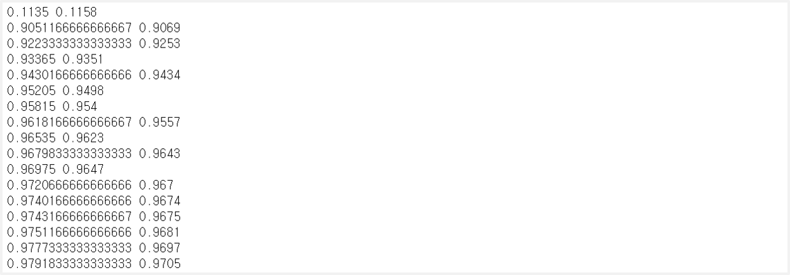

> 이 글은 필자가 [밑바닥부터 시작하는 딥러닝](http://www.yes24.com/Product/Goods/34970929?Acode=101)으로 딥러닝 개념을 공부하며 정리한 글입니다. 혹시 잘못된 부분이 있다면 친절히 가르쳐주시면 감사하겠습니다:)

## 1. 활성화 함수 계층 구현

### ReLU 계층

$$
y = \begin{cases}x & x > 0\\0 & x \leq 0\end{cases}
$$

$$
\frac{\partial y}{\partial x} = \begin{cases}1 & x > 0\\0 & x \leq 0\end{cases}
$$

<br>

우선 `순전파`일 때를 생각해보자. **입력 신호 $x$**에 대해서 보면 다음과 같다.

- **$x > 0$**이면 **입력 신호가 그대로** 다음 노드로 전달되고
- **$x ≤ 0$**이면 0이 다음 노드로 전달된다.

<br>

반대로 `역전파`일 때를 생각해보면, **순방향일 때의 입력 신호 $x$**에 대해서 보면 다음과 같다.

- **$x > 0$**이면 원래 신호에서 1이 곱해지므로 **값이 그대로** 다음 노드로 전달되고,
- **$x ≤ 0$**이면 원래 신호에 0이 곱해지므로 **0**이 다음 노드로 전달된다.

<br>



<br>

```python
class Relu:
    def __init__(self):
        self.mask = None

    def forward(self, x):
        self.mask = (x <= 0)
        out = x.copy()

        # 0보다 작은 요소들은 다 0으로
        out[self.mask] = 0

        return out

    def backward(self, dout):
        dout[self.mask] = 0
        dx = dout

        return dx
```

<br>

### Sigmoid 계층

$$
y = \frac{1}{1 + exp(-x)}
$$

<br>

우선 `순전파`일 때를 생각해보자. sigmoid 계층은 다른 계층과 달리 **여러 번의 국소적 계산의 전파**로 이루어져 있다.

- **×** : 입력 신호 $x$에 -1을 곱하여 다음 노드로 전달한다.
- **exp** : 그 전 신호에 $exp()$연산을 하여 다음 노드로 전달한다.
- **+** : 그 전 신호에 1을 더하여 다음 노드로 전달한다
- **/** : 그 전 신호에 $y = \frac{1}{x}$ 연산을 한다. (=끝)

<br>

반대로 `역전파`일 때를 생각해보자.

- **/** : $y = \frac{1}{x}$의 미분인 $\frac{\partial y}{\partial x} = -\frac{1}{x^2} = -y^2$을 보면, <u>순방향의 출력을 제곱하고 -1을 곱한 값</u>을 신호에 곱하여 다음 노드로 전달한다.
- **+** : 그 전 신호를 그 다음 노드로 그대로 전달한다.
- **exp** : $y = exp(x)$의 미분인 $\frac{\partial y}{\partial x} = exp(x)$을 보면, <u>순방향의 출력</u>을 신호에 곱하여 다음 노드로 전달한다.
- **×** : <u>순방향일 때의 값을 서로 바꿔</u> -1을 신호에 곱한다. (=끝)

<br>



<br>

sigmoid 계층의 역전파를 보면 다음과 같다. 하지만 더 간단히 줄이면 **순방향의 출력값으로만 역전파를 계산**할 수 있다.

<br>

$$
\frac{\partial L}{\partial y}y^2exp(-x) = \frac{\partial L}{\partial y}\frac{1}{(1+exp(-x))^2}exp(-x) =\frac{\partial L}{\partial y}\frac{1}{1+exp(-x)}\frac{exp(-x)}{1+exp(-x)} = \frac{\partial L}{\partial y}y(1-y)
$$

<br>



<br>

```python
class Sigmoid:
    def __init__(self):
        # 역전파 때 쓸 출력 신호 저장
        self.out = None

    def forward(self, x):
        out = 1 / (1 + np.exp(-x))
        self.out = out

        return out

    def backward(self, dout):
        dx = dout * (1.0 - self.out) * self.out

        return dx
```

<br>

## 2. Affine/Softmax 계층 구현

### Affine 계층

$$
Y = X\cdot W + B
$$

$$
\frac{\partial L}{\partial X} = \frac{\partial L}{\partial Y}\cdot W^T
$$

$$
\frac{\partial L}{\partial W} = X^T\cdot \frac{\partial L}{\partial Y}
$$

<br>

Affine 함수는 **행렬의 곱**을 의미한다.

- **앞의 행렬의 column과 뒤의 행렬의 row의 수**를 꼭 일치시켜야 한다.
- $X$와 $\frac{\partial L}{\partial X}$의 크기는 같고, $W$와 $\frac{\partial L}{\partial W}$도 크기가 같다.
  - 각각의 요소에 역전파를 한 것과 같음
  - $X = (x_0, x_1, ..., x_n) → \frac{\partial L}{\partial X} = (\frac{\partial L}{\partial x_0} \frac{\partial a}{\partial x_1}, \frac{\partial L}{\partial x_2})$

#### 입력 데이터 1개



<br>

#### 입력 데이터 N개

입력 데이터가 1개일 때와 거의 같지만, bias에 대한 덧셈에서는 주의를 해야 한다.

- `순방향` : $\textbf{B}$는 $\textbf{X} \cdot \textbf{W}$의 각 데이터에 더해진다.
- `역방향` : 각 데이터의 역전파 값이 $\textbf{B}$의 역전파로 모여야 한다. 즉, $\frac{\partial L}{\partial \textbf{B}}$로 모여야 한다.

<br>



<br>

```python
class Affine:
    def __init__(self, W, b):
        # 매개변수 Weight와 Bias 설정
        self.W = W
        self.b = b
        self.x = None
        self.dW = None
        self.db = None

    def forward(self, x):
        self.x = x                          # 입력 신호 x
        out = np.dot(x, self.W) + self.b    # affine 연산

        return out

    def backward(self, dout):
        dx = np.dot(dout, self.W.T)         # dL/dX
        self.dW = np.dot(self.x.T, dout)    # dL/dW
        self.db = np.sum(dout, axis=0)      # dL/dB

        return dx
```

<br>

### Softmax 계층

#### Softmax 함수

<br>

$$
y_k = \frac{\exp(a_k)}{\sum_{i=1}^n \exp(a_i)}
$$

<br>

소프트맥스 함수는 **입력 값을 정규화**하여 출력한다. 예를 들면 아래와 같이 소프트맥스 함수를 사용할 수 있다. 다만, 신경망 추론을 할 때 소프트맥스 함수를 적용한다고 대소관계가 바뀌지 않으므로 소프트맥스 함수를 쓰지 않는다.

<br>



<br>

#### Softmax-with-Loss 계층

`순전파`로 Softmax-with-Loss 계층을 봐보자.

- **Softmax 계층** : 입력 $(a_1, a_2, a_3)$을 정규화한 출력 $(y_1, y_2, y_3)$를 출력
- **Cross Entropy Error 계층** : $(y_1, y_2, y_3)$, $(t_1, t_2, t_3)$를 입력 받아 손실 함수 값인 $L$을 출력

<br>

`역전파`로 Softmax-with-Loss 계층을 봐보자.

- **Softmax 계층** : 순방향에서의 $(y_1, y_2, y_3)$, $(t_1, t_2, t_3)$의 차인 $(y_1-t_1, y_2-t_2, y_3-t_3)$

<br>



<br>

Softmax 계층에서의 역전파를 보면 **예측값과 레이블값의 오차**를 전달하고 있다. 오차가 크면 학습하는 정도가 커지고, 오차가 작아지면 학습하는 정도가 작아진다.

- `ex1` $Y = (0.3, 0.2, 0.5$, $T = (0, 1, 0)$ → $Y-T = (0.3, -0.8, 0.5)$ : 학습을 더 하자!
- `ex2` $Y = (0.01, 0.99, 0.0)$, $T = (0, 1, 0)$ → $Y-T = (0.01, -0.01, 0.0)$ : 학습을 덜 하자!

```python
class SoftmaxWithLoss:
    def __init__(self):
        self.loss = None   # 손실함수 값
        self.y = None      # Softmax함수의 출력 값
        self.t = None      # 레이블 (one-hot encoder)

    def forward(self, x, t):
        self.t = t
        self.y = softmax(x)
        self.loss = cross_entropy_error(self.y, self.t)

        return self.loss

    def backward(self, dout=1):
        batch_size = self.t.shape[0]
        dx = (self.y - self.t) / batch_size

        return dx
```

<br>

## 3. 오차역전파법 구현

### 2층 신경망 구현

```python
import sys, os
sys.path.append(os.pardir)
from common.layers import *
from common.gradient import numerical_gradient
from collections import OrderedDict

class TwoLayerNet:

    def __init__(self, input_size, hidden_size, output_size, weight_init_std = 0.01):
        # 초기화 : 입력층 뉴런 수, 은닉층 뉴런 수, 출력층 뉴런 수
        self.params = {}   # 신경망의 매개변수
        self.params['W1'] = weight_init_std * np.random.randn(input_size, hidden_size)
        self.params['b1'] = np.zeros(hidden_size)
        self.params['W2'] = weight_init_std * np.random.randn(hidden_size, output_size)
        self.params['b2'] = np.zeros(output_size)

        # 신경망의 계층
        self.layers = OrderedDict()             # 순서가 있는 딕셔너리
        self.layers['Affine1'] = Affine(self.params['W1'], self.params['b1'])
        self.layers['Relu1'] = Relu()
        self.layers['Affine2'] = Affine(self.params['W2'], self.params['b2'])

        self.lastLayer = SoftmaxWithLoss()      # 신경망의 마지막 계층

    # 출력값 예측 by 순전파
    def predict(self, x):
        for layer in self.layers.values():
            x = layer.forward(x)

        return x

    # 손실 함수의 값(=CEE) 계산
    def loss(self, x, t):
        y = self.predict(x)

        # 마지막 계층을 통과하면 CEE를 계산
        return self.lastLayer.forward(y, t)

    # 정확도 계산
    def accuracy(self, x, t):
        y = self.predict(x)
        y = np.argmax(y, axis=1)

        if t.ndim != 1:
            t = np.argmax(t, axis=1)

        accuracy = np.sum(y == t) / float(x.shape[0])
        return accuracy

    # 수치 미분을 통한 기울기 계산
    def numerical_gradient(self, x, t):
        loss_W = lambda W: self.loss(x, t)

        grads = {}
        grads['W1'] = numerical_gradient(loss_W, self.params['W1'])
        grads['b1'] = numerical_gradient(loss_W, self.params['b1'])
        grads['W2'] = numerical_gradient(loss_W, self.params['W2'])
        grads['b2'] = numerical_gradient(loss_W, self.params['b2'])

        return grads

    # 오차역전파법을 이용한 기울기 계산
    def gradient(self, x, t):
        # forward ##########################
        self.loss(x, t)
        ####################################

        # backward #########################
        dout = 1
        dout = self.lastLayer.backward(dout)

        layers = list(self.layers.values())
        layers.reverse()
        for layer in layers:
            dout = layer.backward(dout)
        ####################################

        # 결과를 저장
        grads = {}
        grads['W1'], grads['b1'] = self.layers['Affine1'].dW, self.layers['Affine1'].db
        grads['W2'], grads['b2'] = self.layers['Affine2'].dW, self.layers['Affine2'].db

        return grads
```

### 학습 및 모델 성능 평가

```python
import sys, os
sys.path.append(os.pardir)
from dataset.mnist import load_mnist

# train 데이터와 test 데이터로 분리
(x_train, t_train), (x_test, t_test) = load_mnist(normalize=True, one_hot_label=True)

# 신경망 생성
network = TwoLayerNet(input_size=784, hidden_size=50, output_size=10)

# 하이퍼 파라미터 설정
iters_num = 10000      # 반복 횟수
train_size = x_train.shape[0]
batch_size = 100       # 배치 크기
learning_rate = 0.1    # 학습률

train_loss_list = []   # train 데이터의 손실 함수값 기록
train_acc_list = []    # train 데이터의 정확도 기록
test_acc_list = []     # test 데이터의 정확도 기록

iter_per_epoch = max(train_size / batch_size, 1)

# 반복 학습
for i in range(iters_num):
    batch_mask = np.random.choice(train_size, batch_size)
    x_batch = x_train[batch_mask]
    t_batch = t_train[batch_mask]

    # 기울기 계산
    grad = network.gradient(x_batch, t_batch)

    # weight, bias 업데이트
    for key in ('W1', 'b1', 'W2', 'b2'):
        network.params[key] -= learning_rate * grad[key]

    loss = network.loss(x_batch, t_batch)
    train_loss_list.append(loss)

    if i % iter_per_epoch == 0:
        train_acc = network.accuracy(x_train, t_train)
        test_acc = network.accuracy(x_test, t_test)

        train_acc_list.append(train_acc)
        test_acc_list.append(test_acc)

        print(train_acc, test_acc)
```



<br>
