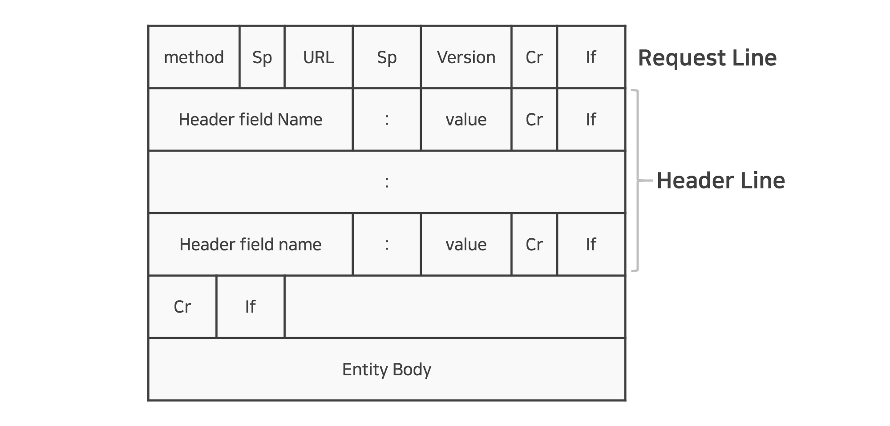
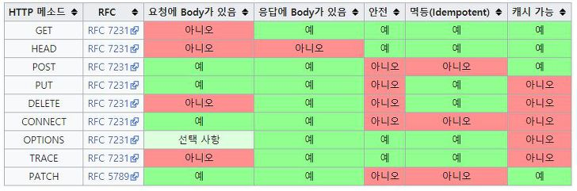

> 이 글은 필자가 [파이썬 웹 프로그래밍](http://www.yes24.com/Product/Goods/63503495)으로 웹과 Django를 공부하며 정리한 글입니다. 혹시 잘못된 부분이 있다면 친절히 가르쳐주시면 감사하겠습니다:)

## HTTP 프로토콜이란?

HTTP(Hyper Transfer Protocol)은 **웹 서버와 웹 클라이언트 사이에서 데이터를 주고받기 위해 사용하는 통신 방식**을 말한다.

- *TCP/IP 프로토콜* 위에서 동작 → *IP주소*가 필요
- HTML, XML과 같은 하이퍼텍스트 뿐만 아니라 이미지, 음성 등 컴퓨터에서 다룰 수 있는 데이터 모두 전송 가능
- 데이터 전송 과정 : `HTTP 연결` → `HTTP 요청` → `요청 처리` → `HTTP 응답 메시지 전송`

## HTTP 메시지의 구조

HTTP는 다음과 같이 **스타트라인**, **헤더**, **바디**로 이루어져있다.

- 스타트라인은 `요청메시지` 일 경우 *요청라인(request line)*, `응답메시지` 일 경우 *상태라인(status line)*이라고 한다.
- 헤더와 바디를 나누기 위한 줄바꿈 문자인 *CRLF(Carraige Return Line Feed)*가 있다.
- 헤더와 바디는 필수가 아니고 선택이다.



### 요청 메시지(request message)

```bash
GET /book/shakespeare HTTP/1.1
Host: www.example.com
```

- `요청라인` : 요청 방식, 요청 URL, 프로토콜 버전
- `헤더` : *이름:값*으로 표현되고 여러 줄로 표현이 가능 but *Host*는 꼭 표시해야한다.
    - `요청라인` 의 URL에 *Host*를 표시하면 생략할 수 있다.


### 응답 메시지(response message)

```bash
HTTP/1.1 200 OK
Content-Type: application/xhtml+xml; charset=utf-8

<html>
...
</html>
```

- `상태라인` : 프로토콜 버전, 상태 코드, 상태 텍스트
    - 상태 코드란 서버의 처리 결과를 말한다.
- `헤더` , `바디` : 이 둘을 구분하기 위한 *CRLF*가 중간에 있으며 `바디` 는 보통 HTML 텍스트를 포함한다.


## HTTP 처리 방식

*HTTP 메소드*를 통해서 **클라이언트가 원하는 처리 방식**을 서버에게 알려준다. 이 중 가장 많이 쓰이는 메소드는 *GET, POST, PUT, DELETE*이다.

- `GET` : 지정한 URL의 정보를 가져오는 메소드. 가장 많이 사용된다.
- `POST` : 리소스를 생성하는 메소드. 이 때 리소스에 대한 URL 결정권은 서버에 있다.
- `PUT` : 리소스를 변경하는 메소드. 이 때 리소스에 대한 URL 결정권은 클라이언트에 있다.
- `DELETE` : 리소스를 삭제하는 메소드. 이 경우 응답에 바디를 반환하지 않는다.

<br>


> 출처: https://ko.wikipedia.org/wiki/HTTP


## GET과 POST 메서드

HTML의 폼에서 지정할 수 있는 메소드는 *GET*과 *POST* 뿐이다.

`GET` : URL 부분의 **?** 뒤에 **이름=값** 쌍으로 이어붙인다.
- URL 길이의 제한으로 많은 양의 데이터를 보내기 어렵다.
- 사용자의 데이터가 웹 브라우저의 주소창에 노출된다는 단점이 있다.

```bash
GET http://docs.djangoproject.com/search/?q=forms&release=1 HTTP/1.1
```

`POST` : 파라미터들을 요청 메시지의 바디에 넣는다.
- 폼을 사용하거나 추가적인 파라미터를 서버로 보내는 경우 사용된다.
- *Django*에서도 폼 데이터는 *POST* 방식만 사용한다.

```bash
POST http://docs.djangoproject.com/search / HTTP/1.1
Content-Type: application/x-www-form-urlencoded

q=forms&release=1
```


## 상태 코드

상태 코드(Status Code)란 **응답 메시지의 상태라인**에 있는 것으로 **서버에서의 처리 결과**를 나타낸다.

- `첫 번째 숫자` : HTTP 응답의 종류
- `나머지 두 개의 숫자` : 세부적인 응답 내용

<br>

`첫 번째 숫자`만 보고 서버의 상태를 대충 파악할 수 있다. 자세한 내용은 [MDN - HTTP 상태 코드](https://developer.mozilla.org/ko/docs/Web/HTTP/Status)를 참고!
