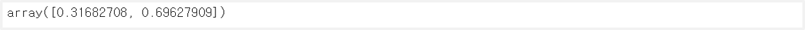

> 이 글은 필자가 [밑바닥부터 시작하는 딥러닝](http://www.yes24.com/Product/Goods/34970929?Acode=101)으로 딥러닝 개념을 공부하며 정리한 글입니다. 혹시 잘못된 부분이 있다면 친절히 가르쳐주시면 감사하겠습니다:)

## 1. 표기법


<br>

- $x_2$ : 입력층의 두 번째 뉴런
- $a_2^{(1)}$ : 1번째 은닉층의 두 번째 뉴런
- $w_{1 2}^{(1)}$ : 입력층(0)의 두 번째 뉴런에서 은닉층(1)의 첫 번째 뉴런으로의 가중치

## 2. 신호를 다음 층으로 전달하기

모든 층은 다음과 같은 과정을 거친다. 입력에 가중치를 곱해 편행을 더한 총합을 구한다. 그리고 그 총합을 활성화 함수에 넣어 구한 출력을 구한 뒤 그것을 다음 뉴런의 입력으로 넣는다.

- 입력층(0) → 은닉층(1) : $h(A^{(1)} = XW^{(1)} + B_{(1)})$
- 은닉층(1) → 은닉층(2) : $h(A^{(2)} = XW^{(2)} + B_{(2)})$
- 은닉층(2) → 출력층(3) : $\sigma(A^{(3)} = XW^{(3)} + B_{(3)})$

## 3. 구현

```python
# 가중치와 편향을 초기화하여 network에 저장
def init_network():
    network = {}
    network['W1'] = np.array([[0.1, 0.3, 0.5], [0.2, 0.4, 0.6]])
    network['b1'] = np.array([0.1, 0.2, 0.3])
    network['W2'] = np.array([[0.1, 0.4], [0.2, 0.5], [0.3, 0.6]])
    network['b2'] = np.array([0.1, 0.2])
    network['W3'] = np.array([[0.1, 0.3], [0.2, 0.4]])
    network['b3'] = np.array([0.1, 0.2])

    return network

# 순방향으로 입력을 출력으로 변환
def forward(network, x):
    W1, W2, W3 = network['W1'], network['W2'], network['W3']
    b1, b2, b3 = network['b1'], network['b2'], network['b3']

    a1 = np.dot(x, W1) + b1
    z1 = sigmoid(a1)
    a2 = np.dot(z1, W2) + b2
    z2 = sigmoid(a2)
    a3 = np.dot(z2, W3) + b3
    y = identity_function(a3)

    return y
```

```python
network = init_network()
x = np.array([1.0, 0.5])
y = forward(network, x)
y
```


