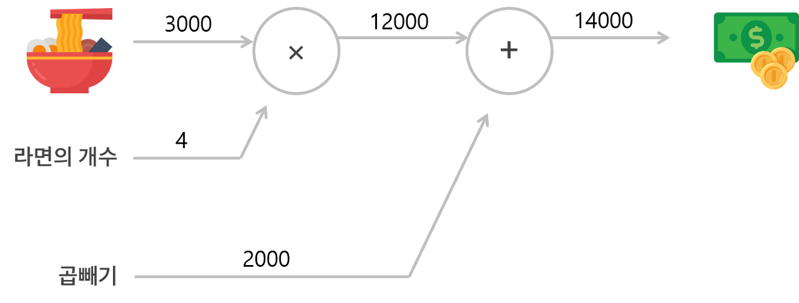
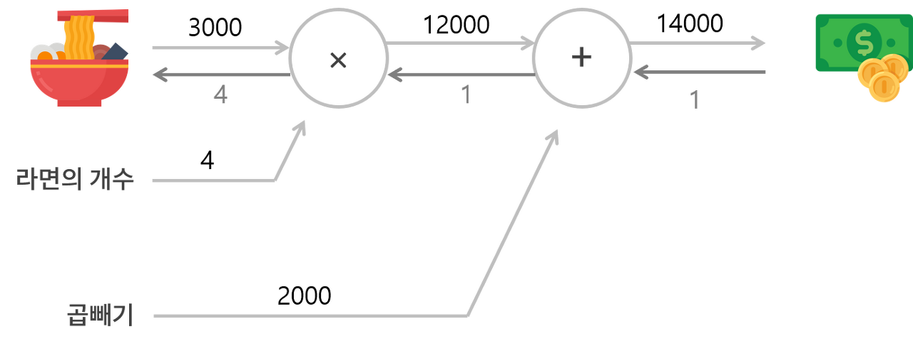
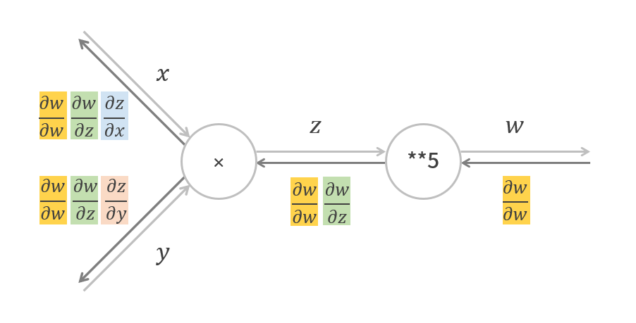
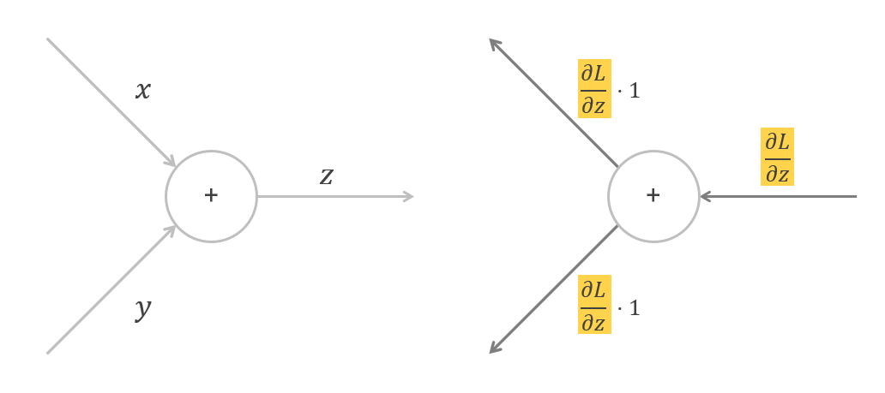

> 이 글은 필자가 [밑바닥부터 시작하는 딥러닝](http://www.yes24.com/Product/Goods/34970929?Acode=101)으로 딥러닝 개념을 공부하며 정리한 글입니다. 혹시 잘못된 부분이 있다면 친절히 가르쳐주시면 감사하겠습니다:)

## 1. 계산 그래프

계산 그래프(computational graph)는 **계산 과정을 그래프로 나타낸 것**이다.

### 순전파 Forward Propagation

<br>



<br>

계산 그래프로 문제를 풀 때는 계산을 `왼쪽→오른쪽`으로 진행한다. 이렇게 왼쪽→오른쪽으로 진행하는 단계를 **순전파(forward propagation)**이라고 한다.

- **국소적 계산**(자신과 직접 관련된 작은 범위)만 하므로 **자신과 관련된 정보만**으로 결과를 출력
- 계산하는 것이 **단순**하기에 복잡한 문제를 단순화할 수 있음
- **중간 계산 결과**를 edge에 적어둠으로써 기록할 수 있음

### 역전파 Back Propagation

<br>



<br>

순전파(forward propagation)과 반대로 `오른쪽→왼쪽`으로 흐르는 것을 **역전파(back propagation)**이라고 한다.

- **국소적 미분**을 edge로 전달하는데 그 미분 값을 edge에 적어놓는다.
- **중간 미분 결과**를 edge에서 확인할 수 있다.

<br>

## 2. 연쇄 법칙 Chain Rule

<br>



<br>

역전파는 **노드로 들어온 입력 신호 E에 해당 노드의 국소적 미분($\frac{\partial y}{\partial x}$)을 곱한 것**을 다음 노드로 전달한다. 이 때 국소적 미분이란 순전파에서의 $y=f(x)$의 미분을 말한다.

- 역전파는 국소적 미분을 다음 노드로 전달한다.
- 첫 입력 신호는 자기자신을 자기자신으로 미분한 1이다.

<br>

## 3. 역전파 Back Propagation

### 덧셈 노드의 역전파

덧셈 노드의 역전파는 **입력된 값을 그대로 다음 노드로 전달**한다.

<br>



<br>

### 곱셈 노드의 역전파

곱셈 노드의 역전파는 **전 노드에서 받은 신호와 순전파 때의 입력 신호들을 서로 바꾼 값을 곱해서 다음 노드들로 전달**한다. 곱셈 노드 구현 시 순전파 때의 입력신호가 필요하므로 이를 변수에 저장한다.

<br>


<br>

### 단순한 계층 구현

모든 계층은 다음의 공통적인 메서드를 포함한다.

- `forward()` : 순전파를 처리
- `backward()` : 역전파를 처리

#### 덧셈 계층

```python
class AddLayer:
    def __init__(self):
        pass

    def forward(self, x, y):
        out = x + y
        return out

    def backward(self, dout):
        dx = dout * 1
        dy = dout * 1

        return dx, dy
```

#### 곱셈 계층

```python
class MulLayer:
    def __init__(self):
        # 순전파 때의 입력값을 저장
        self.x = None
        self.y = None

    def forward(self, x, y):
        self.x = x
        self.y = y
        out = x * y

        return out

    def backward(self, dout):
        dx = dout * self.y
        dy = dout * self.x

        return dx, dy
```
