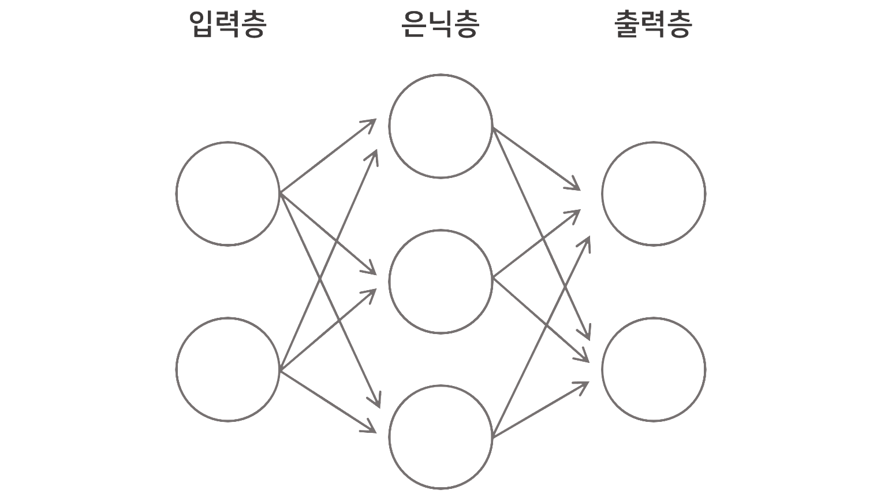
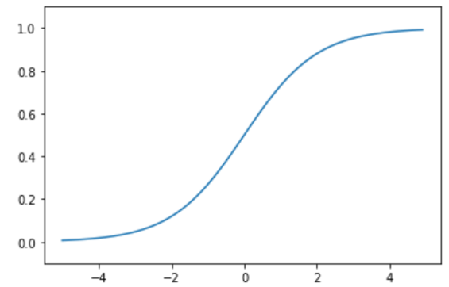
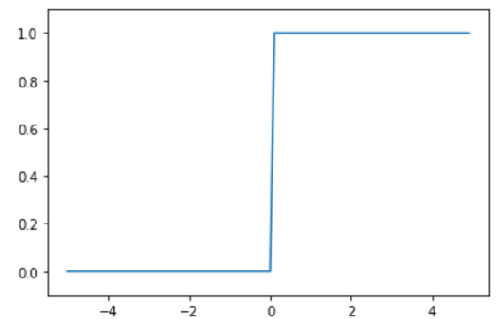
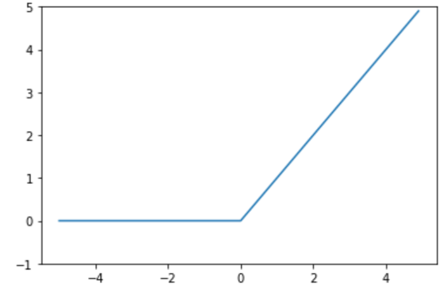
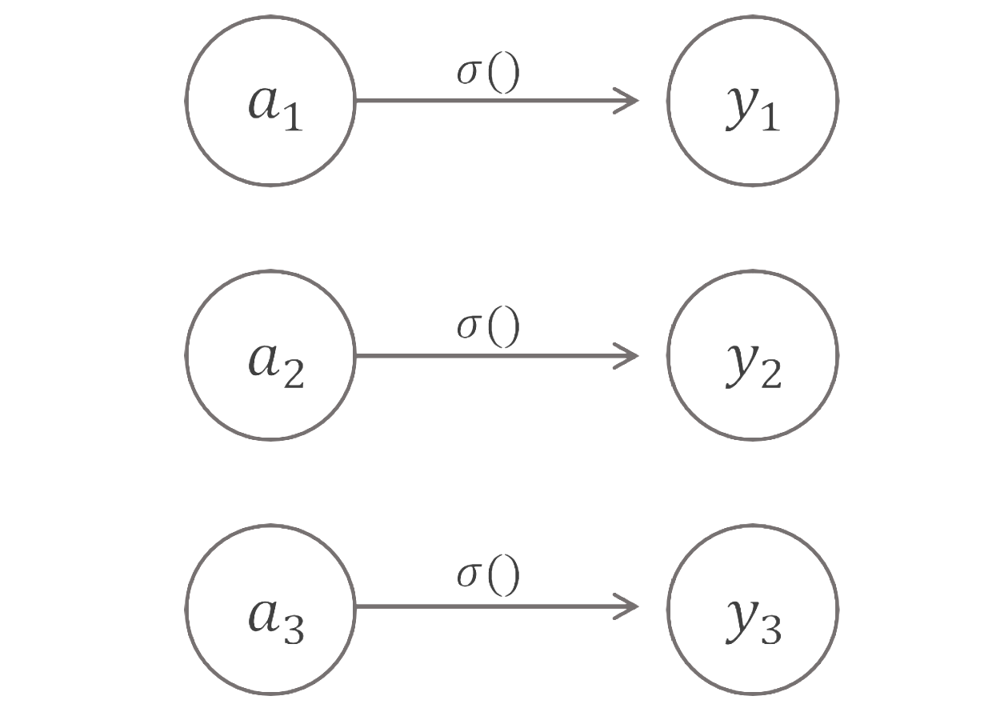
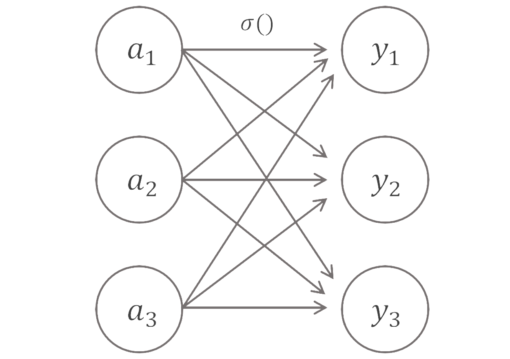
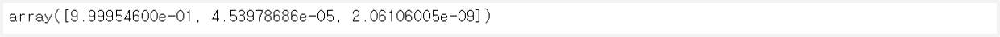

> 이 글은 [밑바닥부터 시작하는 딥러닝](http://www.yes24.com/Product/Goods/34970929?Acode=101)으로 딥러닝 개념을 공부하며 정리한 글입니다. 혹시 잘못된 부분이 있다면 친절히 가르쳐주시면 감사하겠습니다🙏

## 1. 퍼셉트론과 신경망



<br>

퍼셉트론은 복잡한 함수도 표현할 수 있지만, weight를 정하는 것을 사람이 스스로해야 한다는 단점이 있다. 하지만, 신경망은 weight를 데이터 학습을 통해서 알아서 정해준다. 신경망은 아래와 같이 맨 왼쪽에 위치한 `입력층`, 중간에 위치한 `은닉층`, 그리고 맨 오른쪽에 위치한 `출력층`으로 나눌 수 있다.

이 때 입력층의 경우 weight를 갖지 않으므로 **2층 신경망**이라 볼 수 있다.

<br>

## 2. 활성화 함수

활성화 함수는 입력 신호의 합(sum)을 출력 신호로 변환하는 함수를 말한다. 이 활성화 함수는 임계값을 경계로 출력이 바뀐다.

- weight가 달린 입력 신호와 편향의 총합을 구한다.
- 이 총합을 활성화 함수인 $h(x)$에 넣어 출력 신호를 구한다.

### 시그모이드 함수 vs 계단 함수

시그모이드(sigmoid) 함수 $h(x) = \frac{1}{1+exp(-x)}$는 **S자 모양**을 한 함수를 말한다. 시그모이드 함수는 다음과 같은 특성을 가지고 있다.

- 부드러운 곡선이고 입력에 따라 출력이 연속적으로 변화
- 출력 신호로 0과 1사이의 실수 값을 반환

> 시그모이드(sigmoid) 함수와 $tanh$ 함수의 관계 : $tanh(x) = 2sigmoid(2x) - 1$

```python
import numpy as np
import matplotlib.pyplot as plt

def sigmoid(x):
    return 1 / (1 + np.exp(-x))

x = np.arange(-5.0, 5.0, 0.1)
y = sigmoid(x)
plt.plot(x, y)
plt.ylim(-0.1, 1.1)
plt.show()
```



<br>

계단(step) 함수 $h(x) = \begin{cases}1 & x \geq 0\\0 & x < 0\end{cases}$는 계단 모양을 한 함수를 말한다. 단순히 입력이 0을 넘으면 1을 출력하고, 그 외에는 0을 출력한다.

- 0을 경계로 출력이 0에서 1(or 1에서 0)으로 변화
- 0 또는 1 중 하나의 값만 반환

```python
def step_function(x):
    return np.array(x > 0, dtype=np.int)

x = np.arange(-5.0, 5.0, 0.1)
y = step_function(x)
plt.plot(x, y)
plt.ylim(-0.1, 1.1)
plt.show()
```



<br>

두 함수 차이점이 있지만 **공통점**이 존재한다.

- 입력이 작을 때 출력은 0에 가깝고, 입력이 커질 때 출력이 1에 가까워진다.
- 입력이 중요하면 큰 값을 출력하고, 입력이 중요하지 않으면 작은 값을 출력한다.

### 비선형 함수

곡선 모양의 시그모이드(sigmoid) 함수와 계단처럼 구부러진 직선인 계단(step) 함수는 `비선형 함수`로 분류된다. 이 비선형 함수는 신경망에서 정말 중요한다. 신경망에서 선형 함수를 쓸 경우 **신경망을 여러 층으로 구성하는 장점**을 살릴 수가 없다.

예를 들어, $h(x) = cx$라는 활성화 함수가 있다고 하면, 3개의 층을 쌓았을 때 출력은 $y = h(h(h(x))) = c^3x$이다. $c^3 = a$로 치환을 하면 결국에는 1개의 층을 쌓은 신경망과 똑같아진다.

### ReLU 함수

ReLU 함수 $h(x) = \begin{cases}x & x > 0\\0 & x \leq 0\end{cases}$는 입력이 0이 넘으면 그대로 출력하고 0 이하면 0을 출력하는 함수를 말한다. 최근에는 ReLU 함수를 신경망에서 주로 사용한다고 한다.

```python
def relu(x):
    return np.maximum(0, x)

x = np.arange(-5.0, 5.0, 0.1)
y = relu(x)
plt.plot(x, y)
plt.ylim(-1, 5)
plt.show()
```



## 3. 출력층

출력층은 최종 출력을 할 때의 층을 말한다. 이 출력층의 활성화 함수는 **풀고자 하는 문제의 성질**에 맞추어 정해야 한다.

출력층의 활성화 함수는 $\sigma(x)$로 나타낸다.

- `회귀(regression)` : 항등 함수(identity function)
- `2 클래스 분류(2 class classification)` : 시그모이드 함수(sigmoid function)
- `다중 클래스 분류(multi class classification)` : 소프트맥스 함수(softmax function)

### 항등 함수 identity function



<br>

항등 함수(identity function)은 입력을 그대로 출력하는 함수를 말한다.

```python
def identity_function(x):
    return x
```

### 소프트맥스 함수 softmax function



<br>

소프트맥스 함수(softmax function)은 $y_{k} = \frac{exp(a_{k})}{\sum_{i=1}^n exp(a_{i})}$이다.

- $n$ : 출력층의 뉴런 수
- $y_k$ : 그 중 $k$번째 출력 신호
- $a_k$ : $k$번째 입력 신호

소프트맥스 함수는 $e^x$ 지수함수를 사용하는데 입력값이 커질수록 출력값이 기하급수적으로 커진다. 그렇게 되면 **오버플로우 문제**가 발생하게 되는 데 이를 방지하기 위해 상수 $C$를 분모 분자에 곱해준다.

그러면 아래와 같이 나타낼 수 있는데 **소프트맥스 지수 함수의 지수 부분에 어떤 정수를 더하더라도 결과는 바뀌지 않는다**는 것을 알 수 있다.

$$
y_{k} = \frac{exp(a_{k})}{\sum_{i=1}^n exp(a_{i})} = \frac{Cexp(a_{k})}{C\sum_{i=1}^n exp(a_{i})} = \frac{exp(a_{k}+\log{C})}{\sum_{i=1}^n exp(a_{i}+\log{C})} = \frac{exp(a_{k}+C')}{\sum_{i=1}^n exp(a_{i}+C')}
$$

<br>

```python
def softmax(a):
    c = np.max(a)    # 입력으로 받는 a 배열의 가장 큰 수를 상수로 지정
    exp_a = np.exp(a - c)
    sum_exp_a = np.sum(exp_a)
    y = exp_a / sum_exp_a

    return y

a = np.array([1010, 1000, 990])
y = softmax(a)
y
```



<br>

소프트맥스 함수의 출력을 보면 입력의 **대소관계가 유지**되는 것을 알 수 있다. 즉, 소프트맥스 함수의 출력을 확률로 생각할 수 있다. 그래서 **신경망을 이용한 분류**에서 가장 큰 출력을 가진 노드를 해당 클래스로 인식하는데 대소관계가 그대로 유지되므로 **출력층의 소프트맥스 함수를 생략**하는 것이 일반적이다
