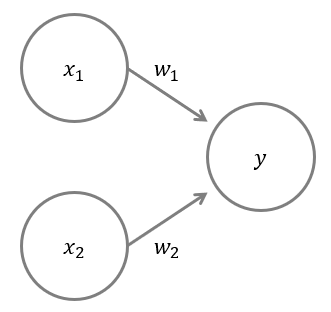
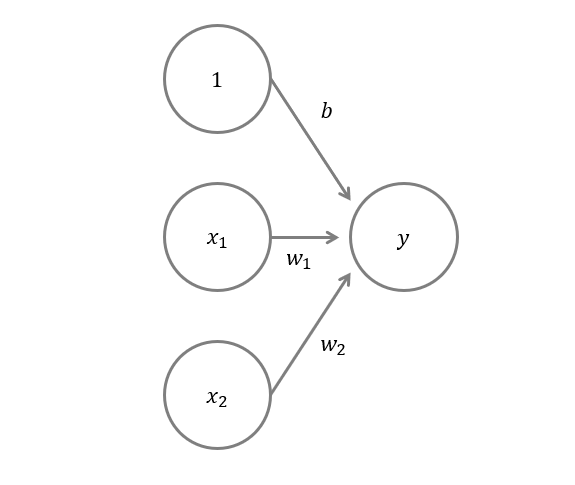
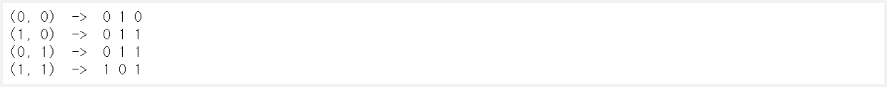
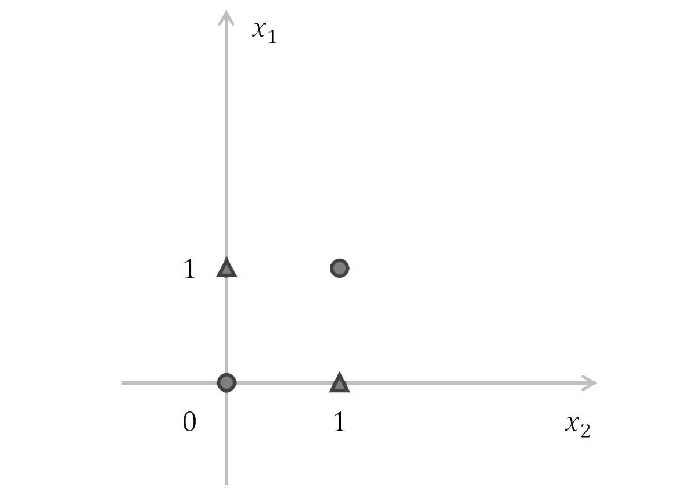
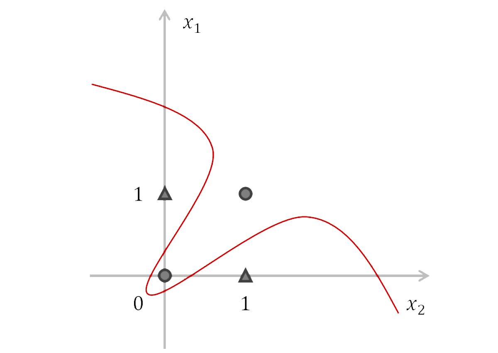
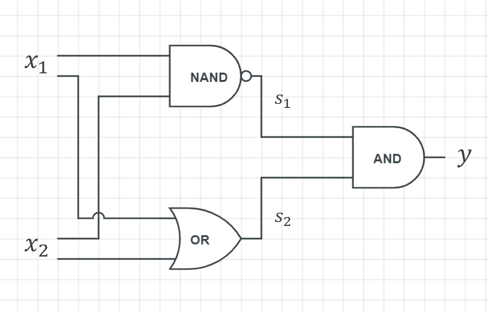
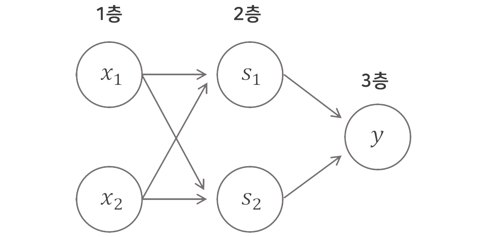
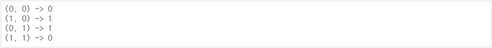

> 이 글은 필자가 [밑바닥부터 시작하는 딥러닝](http://www.yes24.com/Product/Goods/34970929?Acode=101)으로 딥러닝 개념을 공부하며 정리한 글입니다. 혹시 잘못된 부분이 있다면 친절히 가르쳐주시면 감사하겠습니다:)

## 1. 퍼셉트론이란?

퍼셉트론이란 **다수의 신호**를 입력으로 받아 하나의 신호를 출력하는 것



<br>

- $x_1, x_2$ : 입력 신호 (0 또는 1)
- $y$ : 출력 신호
- $w_1, w_2$ : 가중치(weight)
- $\bigcirc$ : 뉴런(노드)
- $\theta$ : 임계값(threshold)

입력 신호 $x_1,x_2$를 받아서 각각 가중치 $w_1,w_2$를 주어 합인 $y$를 구했을 때 임계값 $θ$보다 크면 $1$을 출력하고, 작으면 $0$을 출력한다. 이 때, 가중치인 $w$가 클수록 합인 $y$가 커지므로 **$w$가 클수록 현재 입력신호 $x$가 중요함**을 의미한다. 이를 식으로 나타내면 다음과 같다.

$$
y = \begin{cases}0 & w_1x_1+w_2x_2 \leq\theta\\1 &w_1x_1+w_2x_2 > \theta\end{cases}
$$

## 2. 퍼셉트론 구현하기

### 편향 $b$

$\theta$를 $-b$로 치환하면, 위의 식을 다음과 같이 나타낼 수 있다. 편향을 도입했을 때를 보면, 입력 신호 $x_1, x_2$에 각각 가중치 $w_1, w_2$를 곱하고 편향 $b$를 더한 값이 $0$보다 크면 $1$이 출력되고 작으면 $0$보다 작으면 $0$이 출력된다. 즉, 기준이 더이상 $\theta$가 아닌 $0$이 된다.

$$
y = \begin{cases}0 & b+w_1x_1+w_2x_2\leq0\\1 & b+w_1x_1+w_2x_2>0\end{cases}
$$

하지만, 가중치 $w_1, w_2$와 편향 $b$는 각자 가지는 의미가 다르다. 가중치 $w_1, w_2$는 각각의 입력신호가 얼마나 중요한지를 말하고, 편향 $b$은 **얼마나 쉽게 뉴런을 활성화 하느냐**를 말한다. 결국 임계값의 의미를 말한다.

이를 그림으로 나타내서 보면 다음과 같다. 즉, 입력 신호로 $1$이 들어와서 가중치를 $b$만큼 부여한 것과 같다.



### 퍼셉트론 구현

```python
import numpy as np

# AND 연산자 : 둘 다 true일때만 1을 출력
def AND(x1, x2):
    x = np.array([x1, x2])
    w = np.array([0.5, 0.5])
    b = -0.7
    y = np.sum(w*x) + b
    if y <= 0:
        return 0
    else:
        return 1

# NAND 연산자 : 둘 다 true일때만 0을 출력
def NAND(x1, x2):
    x = np.array([x1, x2])
    w = np.array([-0.5, -0.5])
    b = 0.7
    y = np.sum(w*x) + b
    if y <= 0:
        return 0
    else:
        return 1

# OR 연산자 : 둘 다 false일때만 0을 출력
def OR(x1, x2):
    x = np.array([x1, x2])
    w = np.array([0.5, 0.5])
    b = -0.2
    y = np.sum(w*x) + b
    if y <= 0:
        return 0
    else:
        return 1
```

```python
for xs in [(0, 0), (1, 0), (0, 1), (1, 1)]:
    y1 = AND(xs[0], xs[1])
    y2 = NAND(xs[0], xs[1])
    y3 = OR(xs[0], xs[1])
    print(xs, " -> ", y1, y2, y3)
```



## 3. 퍼셉트론의 한계

### XOR게이트

XOR 게이트는 배타적 논리합이라는 논리회로로, 입력 신호 중 하나가 1일 때만 1을 출력한다. XOR 게이트의 Truth Table을 $x축$을 $x_1$, $y축$을 $x_2$로 하여 좌표평면에 나타내면 다음과 같다.



### 한계

우리가 단순히 입력신호에 가중치를 곱해 더한 것을 좌표평면으로 나타내면 하나의 직선이 그어진다.(이를 선형 영역이라 한다.) 하지만, 위의 입력신호를 0과 1로 나눌만한 직선은 존재하지 않는다. 하지만, 비선형 영역에서 곡선으로는 나눌 수 있다.

즉, 퍼셉트론은 오직 **선형 영역**만 표현할 수 있다.



## 4. 다층 퍼셉트론

여러 층이 쌓인 퍼셉트론을 `다층 퍼셉트론`이라고 한다. 퍼셉트론을 여러 개를 쌓아 XOR게이트를 나타낼 수 있다. 즉, 층을 쌓은 다층 퍼셉트론에서는 **비선형적인 표현**도 가능하고, 이론상으로 **컴퓨터가 수행하는 처리도 모두 표현**할 수 있다.

### 기존 게이트 조합하기

AND, NAND, OR게이트를 조합하여 XOR게이트를 나타낼 수 있다.



### XOR게이트 구현하기



```python
def XOR(x1, x2):
    s1 = NAND(x1, x2)    # NAND
    s2 = OR(x1, x2)      # OR
    y = AND(s1, s2)
    return y

for xs in [(0, 0), (1, 0), (0, 1), (1, 1)]:
    y = XOR(xs[0], xs[1])
    print(str(xs) + " -> " + str(y))
```


