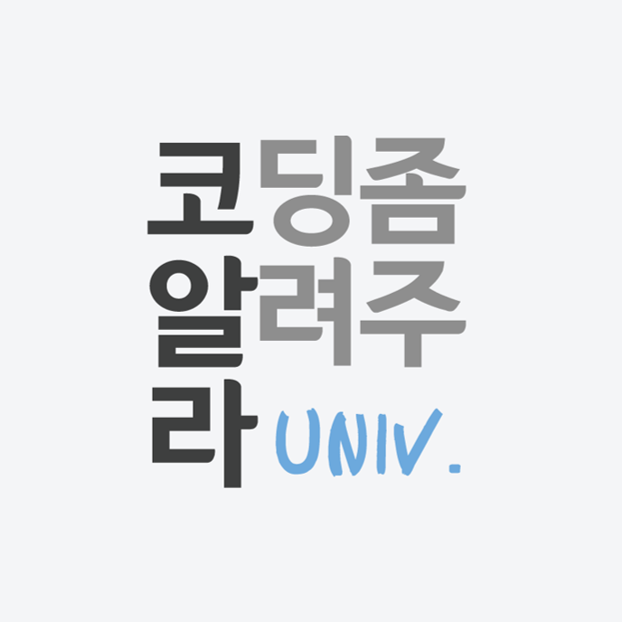
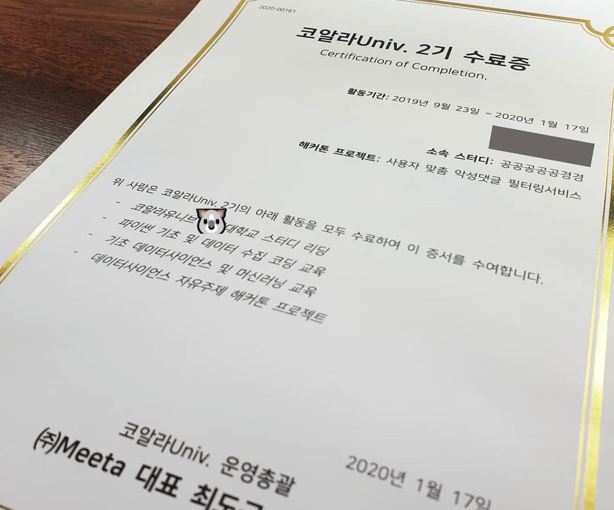

**안녕하세요 코딩하는펭귄입니다!🐧**

작년 2학기에 글이 많이 뜸했었죠? 2학기가 생각보다 힘이 들더라고요😭 공부한 내용을 블로그에 정리해보려 했는데 시간이 나질 않아서 올리질 못했네요. 방학 때 인턴이 끝난 직후에 쉬지도 못하고 개강을 맞이했었습니다. 그러고 **전공 6개+활동 2개**를 병행하려니 많이 힘들었습니다ㅠㅠ 지금은 동아리 활동과 부담 없는 스터디 한 두개로 여유있게 보내고 있습니다😊 맨날 지금과 같으면 좋겠네요!

오늘은 2학기에 했던 활동 중 하나인 **🐨<코알라유니브 2기 활동 후기>🐨**를 적어보려 합니다. 이미 인스타그램(@cooding_penguin)에 올렸지만 블로그에 한 번 더 올립니다!

## 코알라 유니브란?

코알라 유니브는 **데이터 사이언스에 관심 있는 대학생들을 모아 코딩 기초부터 데이터분석, 머신러닝 교육을 받을 수 있는 프로그램**입니다. 이번에는 14개의 대학교에서 학생들을 모집했고 각 학교마다 2개의 스터디를 운영했었습니다. 자세한 내용은 아래 링크를 참고해주세요!

- [코알라 유니브 홈페이지](https://coalastudy.com/)
- [코알라 유니브 페이스북](https://www.facebook.com/coalastudy/)
- [Meeta 홈페이지](https://meeta.io/)

## 공공공공공경경 팀

제가 맡은 공공공공공경경 팀은 공대생 5명과 통계/경제 전공생 2명으로 이루어진 스터디 팀입니다. 학교에서 매주 모여서 코알라 유니브에서 제공한 **학습 자료를 복습**하고 남은 시간에 **추가로 더 배우고 싶은 부분을 공부**했습니다!

> [코알라유니브 2기 공공공공공경경 스터디 자료 모음](https://coodingpenguin.github.io/coala-univ-2/)

### 코알라유니브 학습 자료

`전반기(6주)`에는 파이썬 그리고 데이터 크롤링을 배우고, `후반기(6주)`에는 데이터 사이언스/머신러닝 기초를 배웠습니다. 주차 별로 학습 자료가 제공이 되고 운영진은 현장 강의를 통해, 스터디원들은 인터넷 강의를 통해 공부를 해와야 합니다. 그러고 매주 **한 명의 발표자**를 정해 공부한 내용을 **복습**했습니다.

### Numpy와 Pandas 추가 공부

저희 스터디팀은 코알라 유니브에서 제공하는 학습 자료 외에 추가 공부를 진행하였습니다. 복습을 하고 남은 1시간 동안 **Numpy**와 **Pandas**를 조금 더 깊게 공부하는 시간을 가졌습니다. 스터디 전에 **미리 관련 자료를 공부**하고 스터디 시간에 **실습**을 하는 시간을 가졌습니다.

- `Numpy` : 선형대수 문제 풀기, 성적 계산 해보기
- `Pandas` : 성적 데이터를 가지고 데이터 전처리 해보기

### 코린이 파이썬 스터디

컴퓨터 관련 전공 스터디원들이 많아서 코딩을 잘 모르는 👩‍🦳을 위해 **코린이들을 위한 파이썬 스터디**를 만들었습니다. 정규 스터디 시간 외에 다른 시간을 잡아서 진행을 하였고 **주차마다 공부할 자료**와 과제를 만들어 주었습니다. 4주 동안 진행했으며, 변수부터 시작해 클래스, 상속까지 나갔습니다. "모든 것을 이해시키겠다" 보다는 **"파이썬 문법을 한 번 훑어보자"**라는 느낌으로 진행하였습니다.

## 코알라 유니브 해커톤

코알라 유니브 해커톤은 3주에 걸쳐서 진행되었습니다. 매 주마다 어떻게 해커톤을 준비했는지 써보려합니다.

- **1주차** : 해커톤 기획세션
- **2주차** : 해커톤 구현세션
- **3주차** : 해커톤 발표세션

### 해커톤 기획세션

기획세션을 하기 전에 스터디원들과 만나서 미리 해커톤 주제에 관한 💬브레인스토밍💬을 진행하였습니다. "범죄자 통계를 이용한 마이너리티 리포트📋", "베스트 셀러 책 제목의 특징📚" 등 다양한 주제가 나왔습니다. 하지만, 모두가 동의하는 주제가 나오지 않아 해커톤 기획세션 날 다시 이야기를 하였고, 나왔던 주제들 중 두 개의 주제를 선별하고 4명, 3명으로 팀을 나누었습니다. 저는 그 중 "노래 가사로 노래 장르 예측🎵"이 주제인 팀에 들어갔습니다.

하지만, 주제가 다른 팀과 겹치고 한국 노래 특성 상 사랑 노래가 많아 가사로만 예측하기 힘들어서 주제를 다시 바꾸었습니다. 그렇게 길고 긴 끝에 정한 주제는 바로바로 "**사용자 맞춤 악성 댓글 필터링 서비스**👿"였습니다!

### 해커톤 구현세션

<iframe width="583" height="358" src="https://www.youtube.com/embed/DRLvACqHaUs" frameborder="0" allow="accelerometer; autoplay; encrypted-media; gyroscope; picture-in-picture" allowfullscreen></iframe>

주제를 정하고 **1월 11일** **서울북부창업디딤터**에 모여 **본격적인 구현**을 시작했습니다. 우선 Kaggle에서 "Online Toxic Comment Dataset"을 다운 받아 데이터셋을 살펴보았습니다. 그 후 구현 계획을 세우고 역할 분배를 진행하였습니다. 저👩와 팀원 한 명👩‍🦰은 **EDA, 데이터 전처리 및 모델링**을 진행하였고 나머지 한 명👩‍🦳이 **데이터 분석 결과를 가지고 악성 정도를 판단하는 지표**를 만들었습니다. 나머지 한 명👦은 **서비스 프로토타입을 위한 프론트와 서버 개발**을 하였습니다.

그 날 어느정도 개발을 끝냈지만 성능이 안 좋아서 코드도 한 번 갈아엎었습니다.. 제출 날까지도 매일 만나며 성능을 높였고 서비스 프로토타입을 완성시켰습니다.

### 해커톤 발표세션

제출 마감 날에 코드와 발표 PPT를 제출하고 최종 발표팀 명단을 기다렸습니다. 기다리던 중 공공경경 팀이 발표팀으로 선정되었고 발표자로 저희 팀 막내를 보냈습니다🎉🎉 발표 날 공덕역 근처 카페에서 연습을 하였고 **서울창업허브 10층**에서 첫 발표자로 **최종 발표**를 진행하였습니다.

발표가 끝나고 멘토님들 평으로 "완성도가 정말 높았다😀", "Kaggle에서 흔히 볼 수 있는 악성 댓글을 분류하는 것인 줄 알았는데 새로운 지표를 만든 것이 참신했다😆", "서비스 프로토타입까지 만들었는데 실제로 앱을 만들 수 있을 것 같다😊"가 있었습니다. 다른 팀들도 정말 많은 준비를 해왔고 주제가 정말 다양해 재미있게 들었습니다. (모두 정말 수고하셨어요👏👏)

발표가 끝나고 수료증을 받고 코알라 유니브의 활동을 무사히 마무리할 수 있었습니다.

## 마무리하며

9월부터 1월까지 코알라 유니브 2기 활동을 하면서 정말 많은 걸 배우고 해볼 수 있어서 좋았습니다. 스터디장으로서 부족한 부분도 분명히 있을 거라 생각하는데 잘 따라가준 스터디원들이 정말 정말 감사합니다😍
