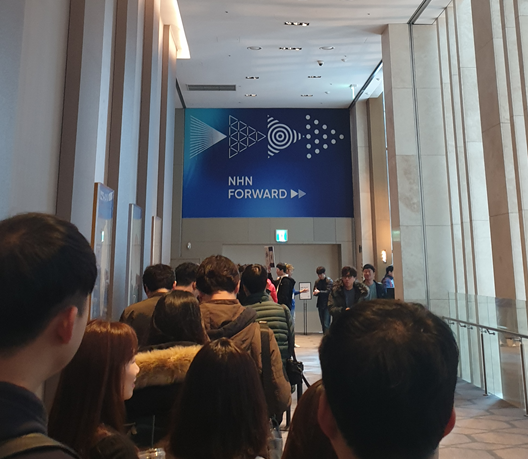
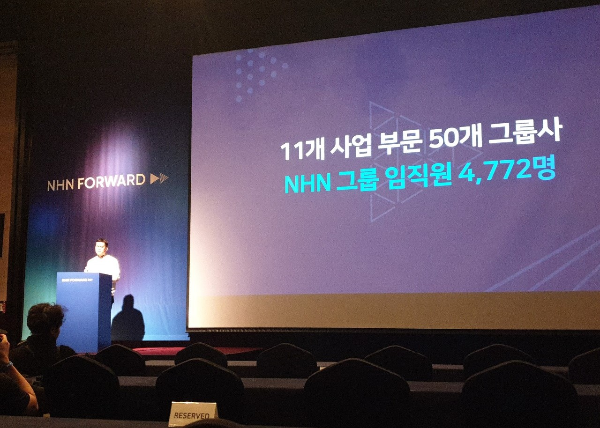
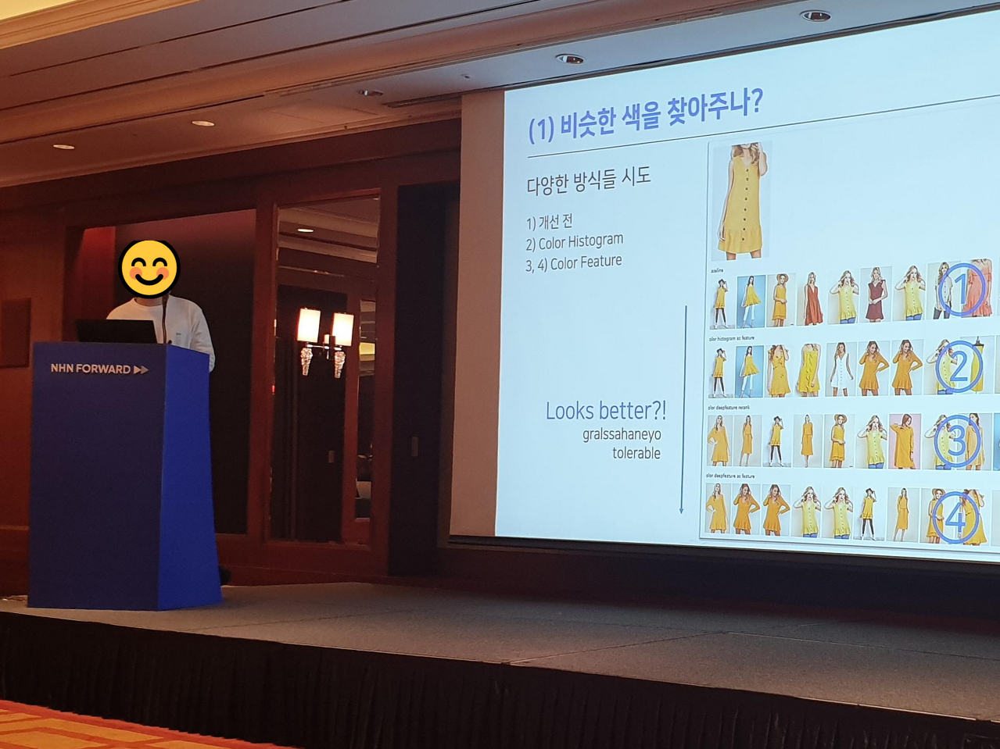

오늘은 저번 학기 때 갔다 왔던 **NHN Forward 2019** 참가 후기를 써보려 합니다. 당첨 안 될 줄 알았는데 되서 평일날 학교 빠지고 갔다왔습니당! 그 외에 머신러닝 워크숍도 신청했었는데 그건 다 안 됐어용😥

## 파르나스 호텔에 도착!

아침 일찍 일어나 지하철을 타고 삼성역으로 향했습니다. 일찍 갔다고 생각했는데 생각보다 사람들이 엄청 많아서.. 코너를 돌고 돌아서 줄이 길게 섰어요. 접수대에 다다라 이름과 이메일을 말하고 개인 참가증을 받았습니당!

## 발표 세션 시작 전에

발표 세션을 하기 전 NHN CEO가 나오셔서 그 동안 NHN이 어떻게 성장해왔는지 이야기해주셨습니다. 끝나고 한양대학교 교수님께서 **추천시스템에 관해 특강**을 해주셨는데 정말 흥미로웠어용!!👍👍

처음에는 추천시스템이 무엇인지 한 번 죽 훑어 주셨는데 예시를 들어서 설명을 해주셔서 처음 접하는 내용임에도 (ex. 협업필터링, PCC 등) 불구하고 이해가 잘 되었습니다!

그리고 기존 추천 시스템을 랩실에서 어떻게 개선시켰는지 이야기해주셨는데 **"사람이 어떤 것에 관심이 있는지"**이 아닌 **"사람이 어떤 것을 싫어하는지"**에 집중해 알고리즘을 짜셨는데 성능이 높게 나와서 신기했어요!

 
초청 특강이 끝나고 첫 번째 발표 세션 장으로 👉👉

## 딥러닝을 이용한 가상 피팅룸

**상품 이미지를 입히는 것**에 관한 내용입니당..

**근데 하나도 이해 못했습니다😢** 간간히 이해가 가다가도 이해가 안되서.. 그래도 인물 사진에 상품 이미지 입히는 과정은 재미있게 봤습니당

## 패션 검색: 사진만 줘, 그 옷 찾아줄게

**이미지 검색 그리고 비슷한 옷 추천하는 것**에 관한 내용이었습니다. 발표자 분이 정말 설명을 잘 해주셨는데 `문제 → 원인 → 해결책 → 문제 → ...` 이렇게 꼬리물기 식으로 설명해주셨습니다!

그나마 아는 내용이 나와서 이해할 수 있었네용

## 깃깔나는 GitFlow

**팀에서 어떻게 Git을 관리할까**에 관한 내용입니다! 첫 시간 그리고 중간 시간에 있는 세션이었는데 사람이 정말 많더라고요. 맨 뒤에서 들었는데 앞 사람에 가려서 PPT는 잘 보진 못했지만 새로운 내용을 알아서 좋았습니다🤗

총 3가지를 알려주셨는데 **GitFlow**, **GithubFlow**, **GitLabFlow** 였습니다! 그리고 각각 어떤 식으로 진행해야 하는지 대체로 어떨 때 저 방법을 쓰는지 알려주셨어요! 마지막으로는 자기 팀에서는 어떤 식으로 하는지 알려주셨습니다!

## 끝나고 나서

깃깔나는 GitFlow까지만 듣고 집으로 향했습니다! **머그컵, 노트북 스티커, 페이코 상품권** 등등 많이 주더라고용 스티커는 이뻐서 이미 하나 붙였습니다ㅋㅋ

**작년 NHN Forward 2019 내용**이 궁금하시면 유튜브에 [발표 영상](https://www.youtube.com/watch?v=l-vPZWOvxis&list=PL42XJKPNDepZVLkCM4yEKmU4LHyXjzChy)이 올라와있으니 그걸 보시면 될 것 같습니다! 여러 키워드도 얻고 먹을 것도 줘서 좋았지만 역시 혼자 갔다 오는 건 힘드네요ㅠㅠ

다음에는 꼭 **친구🧑**랑 같이 가려고용. **후기 끝!**
