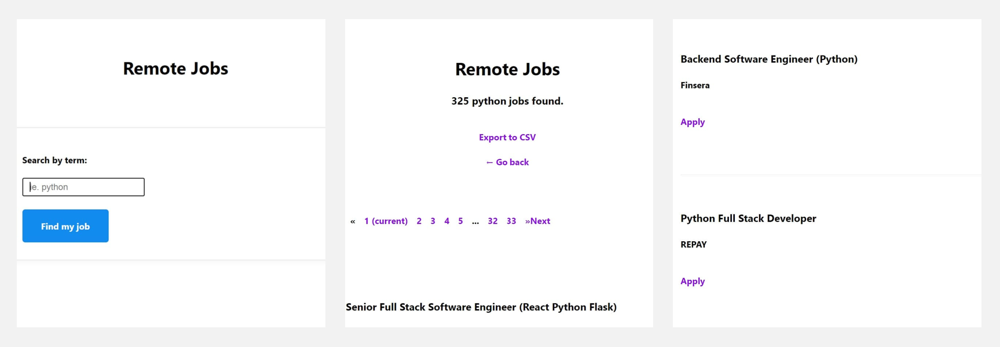
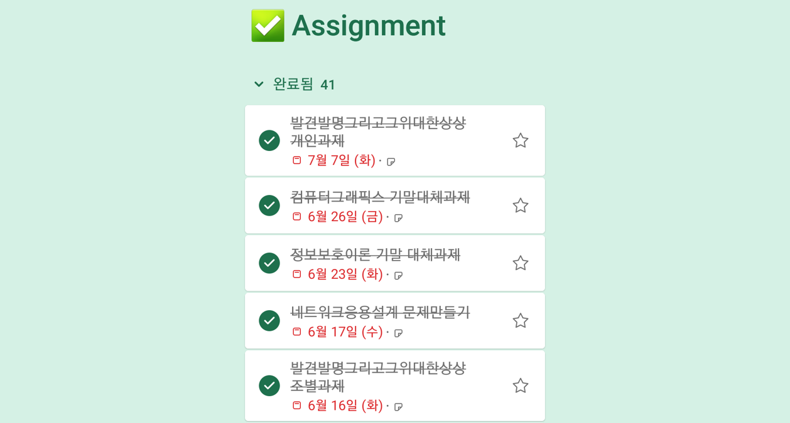
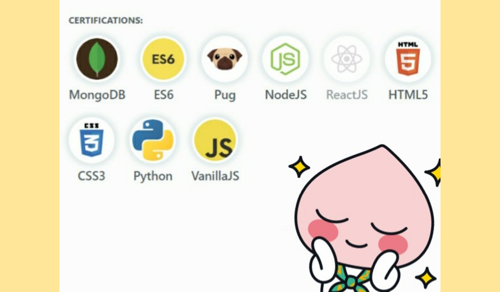

**파이썬 챌린지 1기를 졸업했습니다!🎊**

[유튜브 클론 챌린지 후기](../nomad-coder-youtube-clone-challenge/)에 이어서 파이썬 챌린지 후기를 써보려 합니다! 파이썬 챌린지 1기는 4월에 했었는데 지금이 10월이니 벌써 6개월이 지났군요😮 시간이 참 빠르네요.

이제 후기 시작합니다!!💨

- [내 최애 파이썬](#내-최애-파이썬)
- [크롤링 심화와 간단한 웹사이트 구현](#크롤링-심화와-간단한-웹사이트-구현)
- [지옥의 무한과제 상태](#지옥의-무한과제-상태)
- [파이썬 챌린지 졸업과 그 후](#파이썬-챌린지-졸업과-그-후)

## 내 최애 파이썬

이번 파이썬 챌린지에서는 파이썬 문법과 크롤링 그리고 Flask를 이용한 간단한 웹 구현까지 배웠다! 내 최애 언어인 **💖파이썬💖**을 사용해서 다른 챌린지 했을 때보다는 훨씬 즐겁게 했던 것 같다. 자료구조도 훨씬 자유롭게 쓰고 코드 리팩토링까지 했었다.

파이썬을 알기에 문법보다는 **니꼴라쓰 샘의 코딩스타일**을 많이 살펴보았다. 니꼴라쓰 샘은 `추상화`를 즐겨쓰는데 전체적인 코드 설계를 하고 그 후에 함수를 구현하셨다. 이렇게 해야 함수 혹은 Main함수가 비대해지지 않는다. 이런 방식을 따라하면서 `코딩 습관`이 많이 바뀌었다. 가끔 시간에 쫓겨서 막 짜서 스파게티 코드🍝를 짜기는 하지만 **주석으로 설계를 한 뒤에 함수를 구현**하려고 노력하고 있다.

## 크롤링 심화와 간단한 웹사이트 구현

> 졸업 과제 - stackoverflow와 weworkremote에서 일자리를 크롤링하는 서비스

**크롤링**은 코알라유니브 활동에서 처음 배웠는데 훨씬 깊이있게 배울 수 있어서 좋았다. requests로 데이터 긁어오기, 페이지를 넘기기, csv 파일을 만들기 등을 함수와 여러 파이썬 파일로 세분화를 했다. 그렇게 사이트에 맞추어 데이터를 긁어오는 작업만 코드로 짜주면 나머지는 기존에 작성한 코드로 해결할 수 있었다!

이번 파이썬 챌린지를 하면서 강의가 업데이트되었는데 바로 **Flask 강의🌶️**였다. Flask는 저번에 개인 프로젝트를 할 때 친구한테서 배운 프레임워크인데 다른 모듈을 받아올 필요없이 간단한 `웹사이트`를 만들 수 있고 데코레이터로 `라우팅`까지 가능하다. 단순히 csv파일만 생성해서 저장하는게 아니라 이 데이터를 띄울 수 있는 사이트까지 만들었다!

👉 [파이썬 챌린지 졸업 작품 보러가기](https://Python-Challenge-Graduate--coodingpenguin.repl.co)

## 지옥의 무한과제 상태

> 완료됨 41개 실화냐..?

이 때 학교를 다니고 있었는데 온라인 강의라 과제가 미친듯이 많이 나왔었다. 일주일에 고정적으로 과제 4개가 있었다. 난이도는 `쉬움`에서 `보통`정도 였지만 간간히 `어려움` 난이도의 과제가 끼어있었기 때문에 정말 헬이었다. 온라인 강의? 절대 못하겠다.

어쨌든 이 당시 너무 바빴던 터라 졸업과제에 큰 시간을 쏟지 못했다😥 조금 더 기능을 추가하고 싶었지만은 `flask-pagination` 모듈로 페이지 생성까지 밖에 못했다. 검색기능이나 검색 자동저장 기능 등 여러 기능을 넣고 싶었지만은 그러지 못해서 많이 아쉬웠다ㅠㅠ
⠀

## 파이썬 챌린지 졸업과 그 후

> React 빼고 다 모았다. React 챌린지에 도전했지만..

파이썬 챌린지를 끝으로 챌린지는 참여하지 않았다. 정확히 말하면 **1학기 동안**만이다. 파이썬은 내가 이미 공부한 언어라서 챌린지를 병행할 수 있었지만 새로 배우는 `react`를 학기 공부를 병행하면서 하기에는 너무 벅찼다.

졸업 후 6개월이 지난 후 쓰는 후기라 추가로 적자면 여름방학 때 [리액트 챌린지](https://nomadcoders.co/c/reactjs-challenge/lobby)에 도전했다가 포기했다. 사실 이틀만 버티면 졸업이었는데, 밤이 되서야 강의 듣고 급하게 과제를 끝내서 **"이렇게 졸업해서 의미가 있을까?"** 생각이 들어 포기했다. [클론코딩 영화 평점 웹서비스](http://www.yes24.com/Product/Goods/90344496?OzSrank=1)를 공부하고 16일 뒤 열리는 다음 챌린지에 참여할 예정이다. 다음에는 [리액트 챌린지](https://nomadcoders.co/c/reactjs-challenge/lobby)를 **우수 졸업🎓**해서 찾아오겠다!

그럼 총총💨
