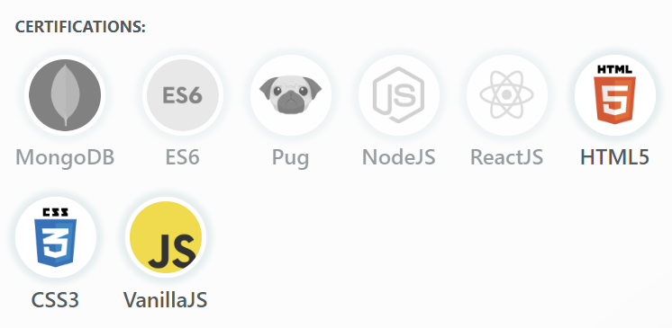
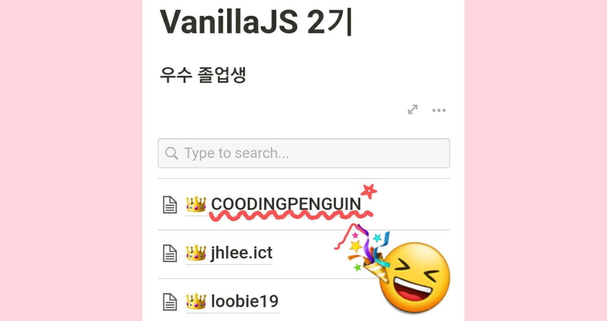

🎉**바닐라 자바스크립트 챌린지 2기를 졸업했습니다**🎉

저번 카카오톡 클론 챌린지처럼 짧은 2주 동안의 기간이었지만 함수로 분리할지, 어떻게 구조를 짜야할지 곰곰히 생각할 수 있었던 좋은 시간이었습니다!

오늘은 **노마드코더 바닐라 자바스크립트 챌린지 후기**를 남겨보려합니다!

## 챌린지 시-작!

> https://gph.is/28V3BN4

이번 챌린지는 [Momentum](https://momentumdash.com/)이라는 **TODO리스트**를 클론하는 것이 최종과제입니다! 클론 하기 전에! 니꼴라스 선생님이 클론하는데 기본이 되는 문법들을 짧게 알려주십니다.

## 구조를 먼저 짜자

**챌린지 3일차** 부터 코딩 과제가 나왔어요. 간단한 상호작용 구현부터 투두리스트, 계산기 만들기 등 배웠던 걸 최대한 써먹을 수 있었습니당.
코딩을 짜기 전에 했던 일을 정리하자면..

1. 기능을 세분화 한다.
2. 비슷한 기능은 하나의 그룹으로 묶는다.

이렇게 **구조를 먼저 짜놓고 구현**을 했습니다! 거기다 저번에 배운 `CSS`를 이용해서 더 예쁘게 꾸몄어용! 로직 짜는 것도 재미있지만 폰트도 넣고 이미지도 삽입하면서 꾸미는 재미도 있었습니다.

<iframe width="560" height="315" src="https://www.youtube.com/embed/ZrCToyTzfEU" frameborder="0" allow="accelerometer; autoplay; clipboard-write; encrypted-media; gyroscope; picture-in-picture" allowfullscreen></iframe>

## 챌린지 뱃지 콜랙터 (feat. 우수졸업)

챌린지가 끝나기 이틀 전 **졸업 과제**를 끝냈습니다. 졸업 과제는 [Momentum 앱](https://chrome.google.com/webstore/detail/momentum/laookkfknpbbblfpciffpaejjkokdgca?hl=ko&utm_source) 클론입니다. 시간이 많이 남아서 꾸미는 데 더 열을 올렸습니다🔥 지금 보니 뿌듯하네요ㅎㅎ 다만 이미지 크기가 커서 로딩하는데 시간이 걸리더라고요. 나중에 이 부분을 고칠 수 있으면 좋겠네용.

👉 [바닐라 자바스크립트 챌린지 졸업 작품 보러가기](https://github.com/CoodingPenguin/momentum-app-clone)

 

이번 챌린지가 끝나고 뱃지를 3개 모았어요! 지금은 유튜브 클론 챌린지를 하고 있는데 아마 끝나면 ReactJS 빼고 다 모을 것 같습니당ㅎㅎ

 

거기다 이번에는 **우수졸업**까지 하게되었습니다👏👏👏

 

잘하시는 분들이 워낙 많아서 생각지도 못했는데 정말 기뻤어용. 다른 졸업자분들도 축하드리고 다음에는 **🎬<유튜브 클론 챌린지 후기>🎬**로 찾아뵐게용

**바바👋**
