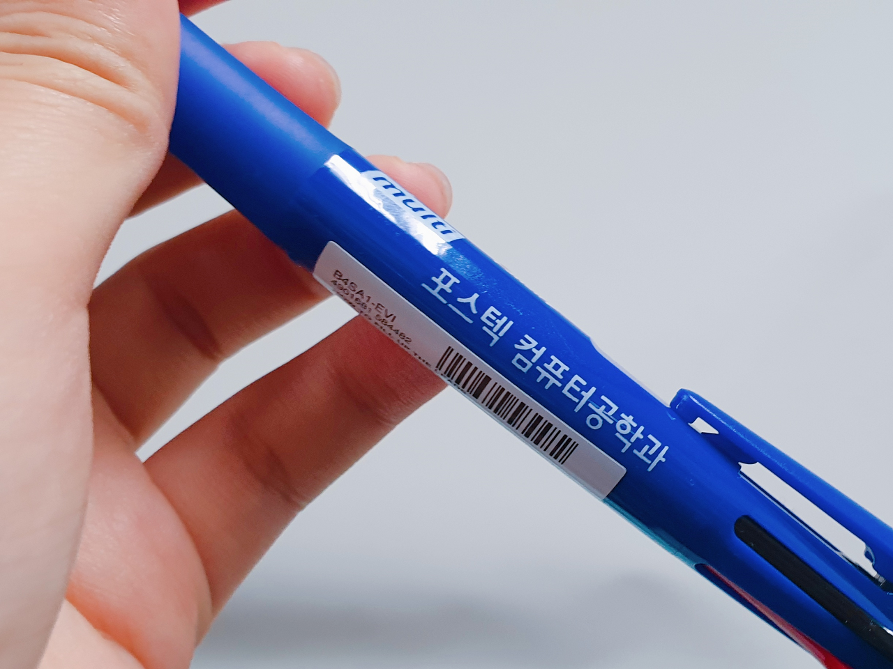
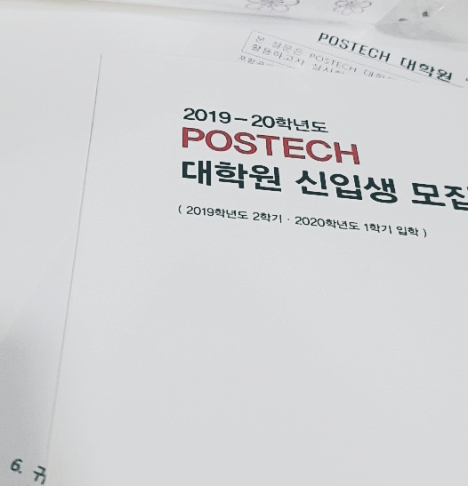

**안녕하세요 코딩하는 펭귄입니다!🐧**

요새 너무 바빠서 포스팅을 하지 못했네요😂 대외활동, 학회, 전공 공부 등등 정말 바쁜데 몸도 안 따라주니까 너무 힘드네요 흑흑. 그래도 오늘부터라도 꾸준히 포스팅을 올릴 예정입니다! 주로 파이썬, 머신러닝 그리고 현재 듣는 전공들(오토마타, 운영체제 등)을 위주로 올릴 것 같아욤.

## 혜화역 토즈워크센터로!

포스텍 컴퓨터 공학 대학원 설명회는 혜화역 2번 출구 근처에 있는 **토즈 워크 센터**에서 오후 5시부터 진행되었습니다. 수업이 5시까지여서 교수님께 양해를 구하고 한 시간 정도 일찍 나와 혜와역으로 갔는데 신용산역 쪽에서 해매서 겨우겨우 도착했네요.

저녁을 안 먹고 와서 급하게 샌드위치를 사서 왔는데 **마실 거**🥛랑 **먹물 앙버터(?)빵**🥐이 제공되었습니다. 근데 설명회 듣느라 먹질 못했네용 그리고 포스텍 컴퓨터 공학과라고 적힌 **4색 펜**🖋을 받았어요ㅎㅎ 설명회는 각 전공별로 진행되었고 컴퓨터 공학과도 작은 강의실에서 소규모로 진행되었습니다!

## 대학원 설명회

교수님 두 분과 행정관련 직원분이 오셨습니다. 처음에는 **포스텍 소개 영상**으로 설명회를 시작했고 그 뒤로 **과**와 **전형** 관련해서 설명을 하셨습니다! 한 30분에서 40분 정도 진행되였고 남은 시간 동안은 **질의응답 시간**을 가졌습니다.

사실 대학원 진학을 결정한 게 얼마 되지 않았고 주변에 대학원 진학을 하는 사람이 거의 없어서 정보를 얻기 힘들었는데 어떻게 준비해야하는지 **방향성을 얻을 수 있어**서 좋았어요. 또한 교수님께서 모든 질문에 다 답을 해주셨어요! 설명회가 끝나고 교수님께 개인 질문을 드렸었는데 `전공 공부`가 더 중요한지 아니면 `연구 분야에 대한 흥미`가 더 중요한지 여쭤봤었습니다. 그 외로 교수님께서 **공부해오면 좋을 것들** 몇 가지를 이야기해주셨습니다!

## 마무리

근데 원하는 교수님 랩실이 이번에 생긴 인공지능 대학원으로 옮기면서 대학원은 조금 더 생각을 해봐야할 것 같네요😥 아마 다음에는 일반대학원이 아닌 인공지능 대학원 설명회를 갈 것 같습니당
