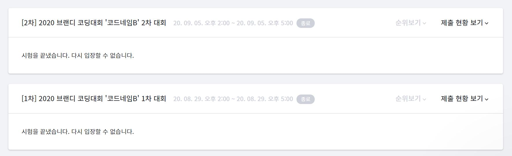
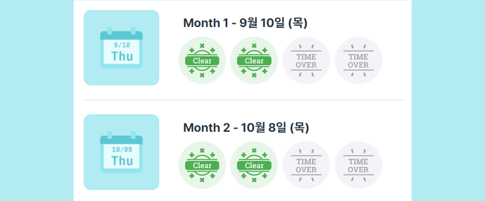
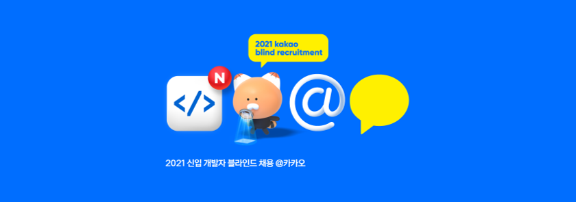

**주의❗❗** 코딩테스트 준비를 한 두달정도 한 **알고리즘 초심자**입니다. solved.ac 기준 **실버I**이므로 이를 감안하고 봐주세요!

- [브랜디 코드네임B 코딩대회](#브랜디-코드네임b-코딩대회)
- [프로그래머스 월간 코드 챌린지 시즌1](#프로그래머스-월간-코드-챌린지-시즌1)
- [카카오 공채 1차 코딩테스트](#카카오-공채-1차-코딩테스트)

## 브랜디 코드네임B 코딩대회

> Goorm 브랜디 코딩대회 페이지

코딩대회는 총 2번에 걸쳐 각각 3시간 동안 진행되었다. IDE는 `Goorm`이었고 총 4문제로 구성되어 있었고 **구현 문제**가 주를 이뤘다.

### 1차 대회

첫 번째 문제는 어렵지 않았지만 <u>입력값을 무한히 받다가 더이상의 입력이 없으면 프로그램을 종료시키는 부분</u>이 헷갈려서 30분을 날렸다. 두 번째 문제는 문제 자체를 이해 못해서 넘어갔고 세 번째 문제와 네 번째 문제를 조금 풀다가 제출했다. 완벽히 풀지는 못했고 테스트케이스 일부만 통과할 정도였다.

### 2차 대회

당연히 떨어질 거라 생각했는데 2차 대회 참가 기회가 주어졌다😂 2차 대회는 1차 대회와 동일하게 3시간 동안 4문제를 풀어야했고 풀다가 머리에 쥐가 난 나는 별 미련 없이 제출해버렸다. 이번에는 0 Solved였지만 수상을 바란 것은 아니었고 참가한 것 만으로도 기뻤다. 후에 시상식에 참여했는데 1등이 무려 **청소년**이었다! 정말 대단하다👍👍 브랜디에서도 많이 놀란 것 같다ㅋㅋ
⠀

## 프로그래머스 월간 코드 챌린지 시즌1

프로그래머스에서 진행하는 **월간 코드 챌린지**이다! 이 챌린지도 3시간 동안 총 4문제가 출제되었다.

### 한 단계씩 어려워지는 문제들

첫 번째 문제는 `combinations` 함수를 쓰면 3분만에 풀 수 있었다! 두 번째 문제는 **삼각달팽이🐌**문제인데, 규칙만 찾으면 쉬운 문제인데 규칙이 조금씩 어긋나서 시간이 많이 걸렸었다ㅠㅠ

세 번째 문제는 **풍선 터뜨리기🎈** 문제로 숫자가 쓰여진 풍선을 특정 규칙으로 터뜨려 최후까지 남는 풍선의 개수를 출력하는 문제이다. 알고리즘은 정말 쉽다! 내 앞과 뒤의 풍선의 최소값보다 큰 풍선은 제외하면 된다. 근데 이 문제는 <u>시간제한</u>이 있어서 일일이 비교해서 풀면 시간초과가 난다ㅠㅠ 입력의 크기가 최대 1,000,000인 것을 보아 적어도 **O(N·logN)**의 알고리즘을 짜야할 것 같은데 결국 짜지 못했고 테스트 케이스의 60%만 통과해서 60점을 획득했다.

### 스탬프와 프로그래머스 굿즈

> 10월 8일 챌린지도 참가하였다! 간단히 2개만 풀고 나왔다.

네 번째 문제는 물론 못 풀었고 전체에서 `450등`을 했다! 총 2 Solved를 해서 스탬프 2개를 얻을 수 있었다. 스탬프를 5개 이상 받으면 이벤트에 참여할 수 있는데 경품 중에 **❤️프로그래머스 굿즈❤️**가 있다. 수상은 못하더라도 이 경품은 받고 싶다ㅎㅎ

참고로 월간 코드 챌린지 문제는 [프로그래머스 코딩테스트 문제 모음](https://programmers.co.kr/learn/challenges)에서 다시 풀어볼 수 있다!

## 카카오 공채 1차 코딩테스트

> 다음에는 4 Solved할 수 있도록!

### 계속 터지는 서버와 어려운 문제들의 콜라보

과거 진행됐던 코딩테스트처럼 <u>5시간동안 총 7문제</u>를 풀어야 한다. 여태까지 봤던 코딩테스트는 최대 3시간이었는데 5시간이라니 "얼마나 어렵길래.."라는 생각이 들었다. 그 전 날 밤을 좀 새운터라 컨디션이 똥망인 상태로 봤는데 역시 어려웠다.. **지금까지 본 코딩테스트와는 다른 느낌.** 거기다 응시자가 많았는지 프로그래머스 서버가 자꾸 끊겼다. 결국 카카오에서 30분 추가시간을 주긴했는데 그래도 버벅거려서 많이 불편했다.

첫 번째 문제는 프로그래머스 기준 **Level1 문제**로 지시문을 따라 그대로 구현하면 된다. 그 이후 문제들은 잘 기억도 안나고 머리가 너무 아파서 2시간만 풀고 제출했다.

### 다음에는 꼭!

사실 처음 본 기업 코딩테스트인데 이번 코딩테스트를 계기로 **내 실력을 가늠할 수 있었다.** 꾸준히 문제를 풀면서 자주 출제되는 `그리디`, `구현` 쪽으로 깊게 공부해야겠다. 다음 코딩테스트 때는 2차도 통과해서 꼭꼭 입사하고 싶다!!
