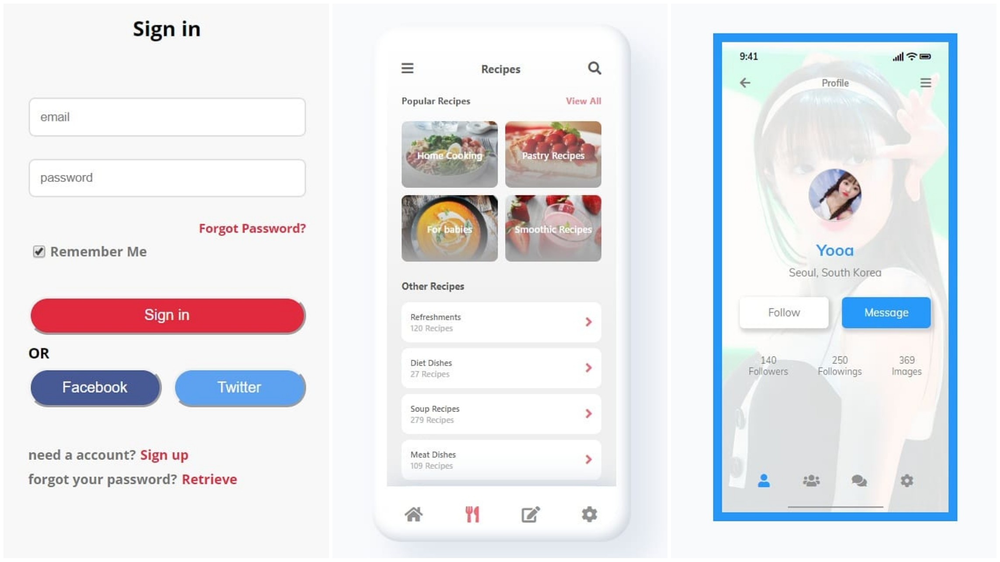

**🎉노마드코더 카카오톡 클론 챌린지 4기를 졸업했습니다🎉**

약 2주 동안 챌린지가 진행되었고 새벽까지 강의 듣고 과제 하느라 힘들었네요😂 짧은 기간임에도 불구하고 실력이 늘은 것 같아 뿌듯합니다. 오늘은 노마드코더 카카오톡 챌린지 후기를 남겨보려 합니당!

## 카카오톡 클론 챌린지 시작🏃‍♀️

1년 전 쯤 카카오톡 클론 강의를 구매했지만 내 게으름 때문에 진도를 빼기 힘들었다. 핑계를 대자면 이론적인 내용을 이미 알아서 그랬던 것 같다.

그러다 노마드코더에서 카카오톡 클론 챌린지 4기를 한다는 메일을 받고 강의를 다시 보기 시작했다! 정해진 진도에 챌린지에서 제공하는 과제를 제출만 하면 된다.
​

> **"쉽게 하겠지"**라는 생각이 들었었는데 나중에 두고두고 후회를 했당..

## 해커톤 해커톤 해커톤!

​
흐흐흐흐흐흑흑😭 챌린지를 시작할 때 까먹었던 게 바로 해커톤이었다.. 해커톤 때문에 많이 바빠져서 매번 새벽 1, 2시쯤 강의를 듣기 시작해서 새벽 4, 5시 쯤에 과제를 끝냈었당. 챌린지 메일은 매일 새벽 6시에 오는데 잠 잘 때쯤 되면 **챌린지 메일**을 받을 수 있었다ㅋㅋㅋ

"포기할까"하는 생각도 했었지만 **"여기까지 왔는데 그만 두기는 아깝다"**라는 생각이 들어서 끝까지 하려 노력했다!

이런 생각 덕분에 끝마칠 수 있었던 것 같다🔥

## 과제는 배운 것보다 어렵습니다

코드를 짜면서 보이는 게 대부분 에러의 원인은 **CSS가 아닌 HTML**이었다. HTML을 잘 짜야 CSS가 잘 적용이 되었다. 니꼴라스 샘의 코드를 따라 써보면서 어떻게 구조를 짜야할지 대충 감이 잡혔다.

챌린지가 힘들었던 다른 이유로는 `과제`였다. 과제가 생각 이상으로 어려워서 제대로 완성시키지 못한 날도 있었다. 그래도 과제를 완성시킨 날은 뿌듯해하며 몇 번이고 완성품을 봤던 것 같당😆

## 축 졸업🎓

    

> https://gph.is/g/aKnWew6

다른 사람들이 한 것들을 보니 너무 잘해서 졸업을 못할 것 같았다.. 졸업 명단이 메일로 왔고 두구두구대며 졸업 명단을 봤는데 내 이름이 있었다ㅠㅠ 잘 가르쳐주신 **니꼴라스 선생님** 정말 감사하고 **다른 졸업자 분들**도 축하드립니다!

👉 졸업 작품은 <a href="https://github.com/CoodingPenguin/kakao-clone">여기</a>서 확인하실 수 있습니다!
