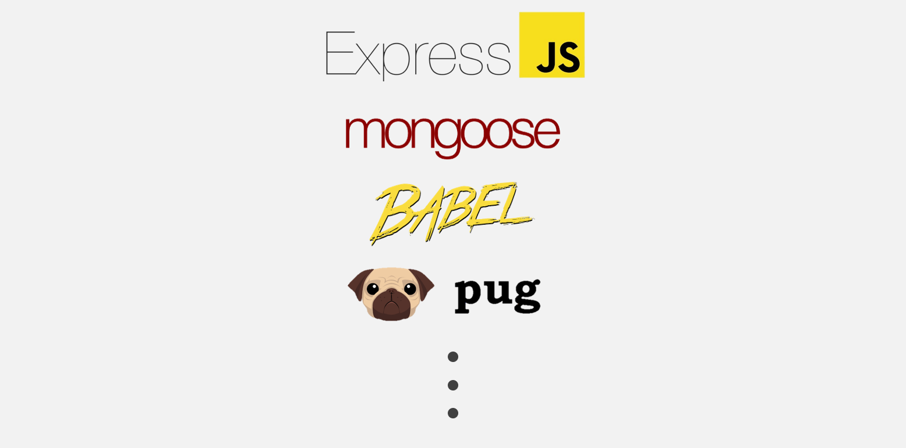
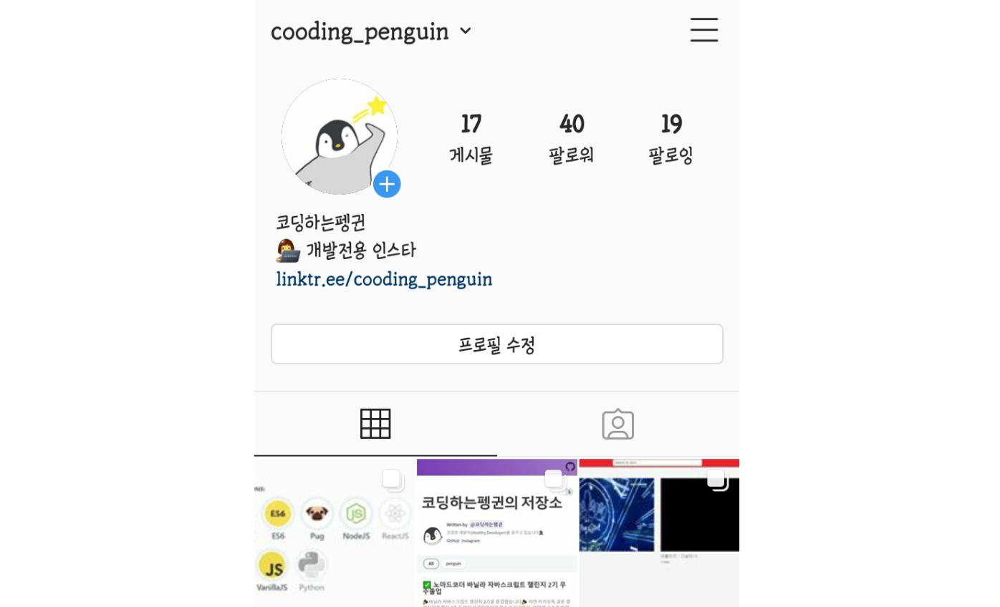
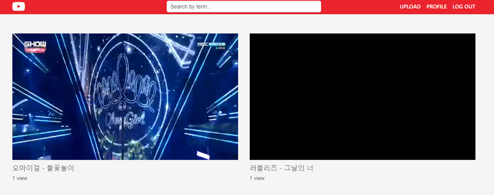
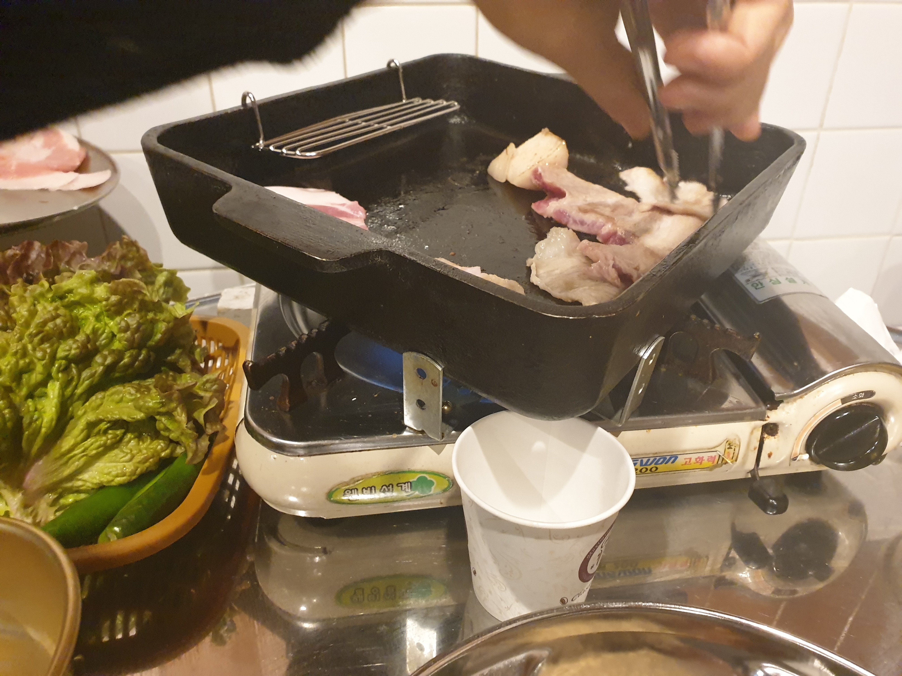

**🎉유튜브 클론 챌린지 3기를 졸업했습니다!🎉**

졸업한지는 한 6개월 정도 지났지만 인스타그램에 남겨놓은 후기를 되새기며 **유튜브 클론 챌린지 후기**를 써보려합니다! 그럼 고고💨

- [처음 시작하는 백엔드](#처음-시작하는-백엔드)
- [이건 껌이지 했다가 제가 씹혔습니다..](#이건-껌이지-했다가-제가-씹혔습니다)
- [챌린지가 끝난 직후에](#챌린지가-끝난-직후에)
- [뱃지 근황과 니꼴라쓰 샘의 칭찬](#뱃지-근황과-니꼴라쓰-샘의-칭찬)

## 처음 시작하는 백엔드

이번 유튜브 클론 챌린지에서는 `Javascript`로 프론트를, `nodejs`로 백엔드를 구현한다! 처음 접한 nodejs 세계는 정말 혼란스러웠다😱 [바닐라 자바스크립트 챌린지](../nomad-coder-vanilla-javascript-challenge) 때는 로직을 짜고 그것을 그대로 구현하기만 하면 됐는데 _morgan_, _body-parser_, _babel_, _pug_, _mongoose_ 등 많은 라이브러리를 쓸 줄 알아야 했다. 지금이야 *pug*는 템플릿, *mongoose*는 코드로 데이터베이스 조작 등 각각의 용도를 알지만 처음 시작할 당시 "이 많은 라이브러리를 다 알아야한다고?"하고 겁을 많이 먹었었다.

## 이건 껌이지 했다가 제가 씹혔습니다..

처음 보는 라이브러리를 익히는 것도 힘들었지만 **6주 동안 끊임 없이 나오는 과제**가 정말 힘들었다. 정말 다행인 건 6주 동안의 챌린지여서 `퀴즈`와 `구현과제`가 적절히 섞여서 나왔다. 며칠동안의 `구현과제`로 심신이 지쳐있을 때 `퀴즈`가 과제로 나오면 정말 행복했었다😂

> 3일 과제를 하시는 분이 있으시다면 꼭 미리미리 하세용😥

그 중 가장 기억에 남는 과제가 있는데 **3일 과제**였다. 한 번 쓱 보고 "오 했던 거랑 비슷하네"하고 마지막 날 몰아서 했는데.. 결국 새벽까지 과제를 하게 되었다. 했던 것과 비슷했지만은 **GET**, **POST**의 차이, 각 라이브러리의 목적을 이해하지 못하면 짜기가 힘들었다. 그래도 `구글링 + 강의 복습`으로 새벽 4시쯤에 과제를 끝냈다.

## 챌린지가 끝난 직후에

**6주간의 대장정을 거쳐 유튜브 클론에 성공하였다!**

챌린지가 끝나고 "웹사이트 하나 쯤이야 만들 수 있다"는 **자신감**과 "웹사이트 만드는 게 이렇게 어렵다고?"하는 **공포감**이 혼재해있었다. 지금와서 보면 정말 당연한 것이 <u>어떤 프레임워크도 사용하지 않았기 때문</u>에 사이트 만드는 게 어려울 수 밖에 없다. 프론트로 `react`를 쓰면 훨씬 더 간단히 사이트를 만들 수 있는데 그 당시에는 `react`의 존재를 몰랐던 터라 많이 공포스러웠다😱

그리고 JavaScript와 윈도우 운영체제에 대한 빡침💢도 있었다. "난 최대한 컴파일이 성공하도록 노력한다"는 JavaScript의 노오력 덕분에 한 시간 삽질은 기본이었다😇 거기다 `package.json`의 scripts를 잘 때 니꼴라쓰 샘의 리눅스 명령어를 윈도우 명령어로 바꿔서 짰는데 계속 에러가 터졌다. 이 때 **맥북💻**을 얼마나 사고 싶었는지 모른다. (지금도 맥북을 사고 싶다.. WSL2가 아무리 좋아졌든 로컬 자체가 리눅스인 것보다 못하다.)

## 뱃지 근황과 니꼴라쓰 샘의 칭찬

> 이 때 당시 Python은 곧 받을 예정이었고 ReactJS만 성공하면 됐는데 지금은..

유튜브 클론 챌린지를 졸업하고 `MongoDB`, `ES6`, `PUG`, `NodeJS` 뱃지를 획득했다! 유튜브 클론 챌린지가 끝나고 바로 [파이썬 챌린지]()를 시작해서 `Python`도 받았고 `ReactJS` 뱃지만 남겨두고 있었다. 비록 저번 번아웃으로 인해 리액트 챌린지를 통과하지 못했지만 곧 나가오는 챌린지에 다시 참여할 예정이다.

 

<iframe width="560" height="315" src="https://www.youtube.com/embed/RVTk3EGuo5c" frameborder="0" allow="accelerometer; autoplay; clipboard-write; encrypted-media; gyroscope; picture-in-picture" allowfullscreen></iframe>

유튜브 클론 챌린지는 개인적으로 많이 힘들었던 챌린지여서 우수 졸업은 바라지도 않았고 **무사히 졸업만 하면 좋겠다**는 생각을 했다. 비록 우수 졸업은 하지 못했지만 니꼴라쓰 샘의 코드리뷰에서 내 동영상 플레이어 과제를 칭찬해주셨다!! 우리가 흔히들 쓰는 동영상 플레이어와 최대한 똑같이 만드려고 노력했다. 그 노고를 알아주셔서 정말 좋았다😁

## 마무리

6주간 정말 힘들었지만 정말 배운 게 많은 6주였다. [바닐라 자바스크립트 챌린지](../nomad-coder-vanilla-javascript-challenge)까지 합하면 거의 8주간 JavaScript만 사용했는데 그래도 JavaScript가 낯설다..

이 때 정말 열심히 코딩했고 열심히 공부했다. 다시 그 때로 돌아가고 싶은 기분도 든다. [리액트 챌린지](https://nomadcoders.co/react-for-beginners)는 첫 시도 때 번아웃이 겹쳐 포기했지만 이번에는 열심히 해서 **우수 졸업🎓**까지 해볼 것이다. 화이팅💪💪
