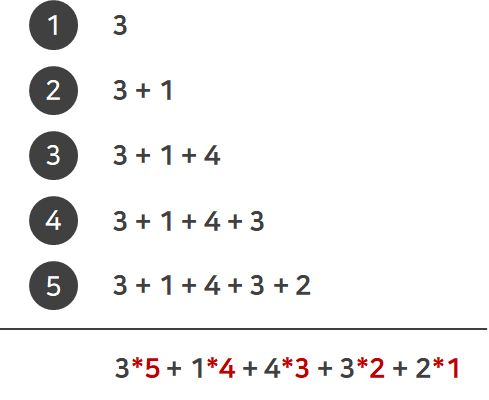

## 문제

BOJ 11399번 : [ATM](https://www.acmicpc.net/problem/11399)

## 접근 방법

총 시간을 더하는 데 있어서 가장 먼저 온 사람일 수록 weight가 증가한다. 예제 입력1을 통해서 한 번 생각해보자. 5명의 사람이 있고, 첫 번째 사람부터 3분, 1분, 4분, 3분, 2분이 걸린다. 그 다음 사람은 그 전 사람의 총 시간을 갖고 자신의 시간을 더하게 되므로 총 시간을 구할 때 "첫 번째 사람은 자신의 시간의 5배, 두 번째 사람은 자신의 시간에 4배 ..." 이런 식으로 weight를 갖게 된다.

<br>



## 소스코드

```csharp
using System;
using System.Collections.Generic;
using System.Linq;
using System.Text;
using System.Threading.Tasks;

namespace Practice
{
    class Program
    {

        static int[] time;

        static void Main(string[] args)
        {
            int numOfPeople = 0;

            /*-------------------입력-------------------*/
            numOfPeople = int.Parse(Console.ReadLine());
            time = new int[numOfPeople];

            string input = Console.ReadLine();
            string[] parsing = input.Split(' ');

            for(int i = 0; i < time.Length; i++)
            {
                time[i] = int.Parse(parsing[i]);
            }
            /*-----------------------------------------*/

            int result = SumOfTime();
            Console.WriteLine(result);
        }

        static int SumOfTime()
        {
            Sort();

            for(int i = 0; i < time.Length; i++)
            {
                time[i] *= time.Length - i;
            }

            int total = 0;
            for(int i = 0; i<time.Length; i++)
            {
                total += time[i];
            }

            return total;
        }

        static void Sort()
        {
            for(int i = 0; i < time.Length -1; i++)
            {
                int temp = i;
                for(int j = i+1; j < time.Length; j++)
                {
                    if (time[temp] >= time[j])
                        temp = j;
                }

                Swap(i, temp);
            }
        }

        static void Swap(int x, int y)
        {
            int temp = time[x];
            time[x] = time[y];
            time[y] = temp;
        }
    }
}
```
