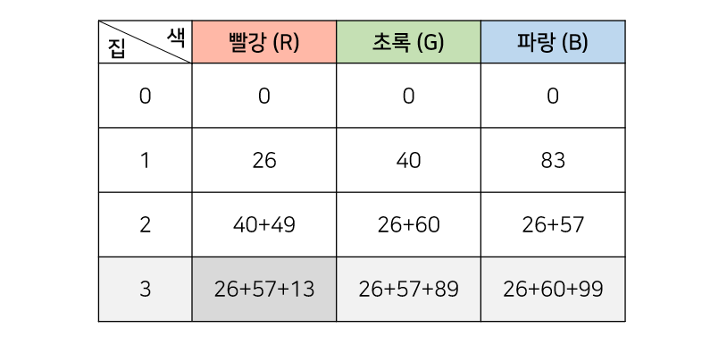

> 잘못된 부분이 있다면 친절히 말씀해주시면 감사하겠습니다🙏

## 문제

BOJ 1149번 : [RGB거리](https://www.acmicpc.net/problem/1149)

## 접근 방법

일련의 $N$개의 집이 주어졌을 때, **다음의 규칙**을 가지고 칠할 때 <u>최소 비용</u>을 구하는 문제이다.

- $1$번 집의 색은 $2$번 집의 색과 같지 않아야 한다.
- $N$번 집의 색은 $N-1$번 집의 색과 같지 않아야 한다.
- $i$($2 ≤ i ≤ N-1$)번 집의 색은 $i-1$번, $i+1$번 집의 색과 같지 않아야 한다.

### 설명

동적계획법에서 가장 중요한 것은 **현재에 집중하는 것**이다. 이 문제에서는 $i$번째 집을 어떻게 칠할지 결정하기 위해서는 $i-1$번째 집의 색을 피하면 된다!

예를 들면, 세 번째 집을 빨간색으로 칠한다고 할 때 두 번째 집을 초록색, 파란색으로 칠했을 때 중 가장 저렴한 비용에 세 번째 집을 빨간색으로 칠할 때의 비용을 더해주면 된다. 그럼 계속 최소 비용을 유지한 채로 칠할 수 있다. 문제의 예시로 표를 그리면 다음과 같다.



### 결론

$N$개의 집을 칠하는 것도 동일하다. 앞의 집의 각 색의 비용을 보고 <u>지금 칠하려는 색을 제외한 색 중 최소 비용을 계산해 현재 칠하려는 색의 비용을 더해주기만 하면</u> 된다. 그럼 다음과 같은 점화식이 도출된다.
이렇게 구한 값 중 $rgb[N]$의 여러 값 중 최소값이 **모든 집을 칠할 때 드는 최소 비용**이다!

$$
rgb[i][r] = cost[i][r] + min(rgb[i-1][g], rgb[i-1][b])
$$

$$
rgb[i][g] = cost[i][g] + min(rgb[i-1][r], rgb[i-1][b])
$$

$$
rgb[i][b] = cost[i][b] + min(rgb[i-1][r], rgb[i-1][g])
$$

- $cost[r]$ : i번째 집의 빨간색을 칠할 때의 비용
- $rgb[i][r]$ : i번째 집을 빨간색으로 칠할 때의 현재까지의 최소 비용

## 교훈

동적계획법은 **현재를 기준으로 과거를 추측하는 것**이다. 이 문제에서도 내가 이 집을 빨간색을 칠할지, 파란색을 칠할지는 모른다! 다만 내가 빨간색을 칠한다면 그 직전의 집은 파란색이나 초록색일 것이다. 이렇게 현재를 기점으로 과거를 추측하고 이를 `점화식`으로 나타낼 수 있다.

## 소스 코드

```python
import sys

N = int(sys.stdin.readline())
rgb = [[0, 0, 0]]

for _ in range(N):
  r, g, b = map(int, sys.stdin.readline().split())
  new_r = r + min(rgb[-1][1], rgb[-1][2])
  new_g = g + min(rgb[-1][0], rgb[-1][2])
  new_b = b + min(rgb[-1][0], rgb[-1][1])
  rgb.append([new_r, new_g, new_b])

print(min(rgb[N]))
```
