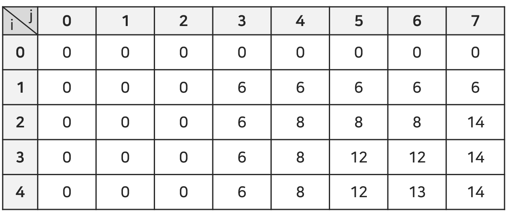

## 문제

BOJ 12865번 : [평범한 배낭](https://www.acmicpc.net/problem/12865)

## 접근 방법

거의 모든 컴공 전공생들이 절대로 까먹지 않을 대표 문제이다. 지금까지 했던 방법으로 이 문제를 접근하면 조금 낯설 수도 있지만 한 번 그대로 접근해보자!

### 설명

동적계획법 문제의 첫 번째 단계인 **현재를 기준으로 과거를 추측**을 해보자. 물품의 수는 $N$, 준서가 버틸 수 있는 무게를 $K$이다. 또한 물건을 무게순으로 정렬하여 작은 것을 가장 먼저 넣는다고 가정한다. 그럼 이 문제에서의 현재는 무엇일까? 바로 <u>물건을 n개, 무게는 k까지 넣을 수 있는 상황에서 n번째 물건을 넣을지 말지</u>를 말한다. (이 때, $n ≤ N$이고 $k ≤ K$이다.) 문제의 예시를 가지고 케이스를 나누어 보자.

#### 경우 1. 물건을 넣을 수 없을 때

*물건 2개, 무게는 3를 들 수 있고* 현재 물건이 `(4, 7)`일 때, 넣을 수 없으므로 <u>물건 1개, 무게는 3일 때의 최대 가치합인 6</u>이 현재의 최대값이 된다. 

#### 경우 2. 물건을 넣을 수 있지만 그 전의 가치합을 그대로 따를 때

*물건을 3개, 무게는 7를 들 수 있고* 현재 물건이 `(5, 12)`일 때, 넣을 수 있으므로 현재 물건을 넣을지 말지를 결정해야 한다. 만약 넣는다고 하면, 현재 가능한 무게인 7에서 5를 뺀 <u>무게가 2이고, 물건은 2개까지 가능할 때의 가치합인 0</u>에 현재 가치인 12을 더한 12가 된다. 만약 넣지 않는다면, 바로 전 <u>무게가 7이고, 물건은 2개까지 가능할 때의 가치합인 14</u>가 된다. 둘 중 가장 큰 가치합인 14가 현재의 최대 가치합이 된다. 

#### 경우 3. 물건을 넣을 수 있지만 가치합을 갱신할 때

*물건 2개, 무게는 7을 들 수 있고* 현재 물건이 `(4, 7)`일 때, 넣을 수 있으므로 현재 물건을 넣을지 말지를 결정해야 한다. 만약 넣는다고 하면, 현재 가능한 무게에서 4를 뺀 <u>무게가 3이고 소지 가능한 물건이 1개일 때의 가치합인 6</u>에 현재 물건의 가치인 7을 더한 가치합 14가 된다. 만약 넣지 않는다면, <u>물건 1개, 무게는 7을 들 수 있을 때</u>의 가치합인 6이 된다. 둘 중 가장 큰 가치합인 14가 현재의 최대 가치합이 된다.

### 결론

모든 경우의 수를 테이블로 나타내면 다음과 같다. $i$는 현재 소지 가능한 물건의 개수이고 $j$는 들 수 있는 무게이다. 각 칸은 소지 가능한 물건의 개수가 $i$이고 들 수 있는 무게가 $j$일 때의 최대 가치합이다.



<br>

정리하면 제약사항인 무게와 물건의 개수에 따라 **최대 가치합**을 갱신하면 된다. 즉, 현재의 상황에서 과거의 상황에서 현재 물건을 넣을 수 있는지 없는지 판단한다. 넣을 수 없다면 바로 그 전의 최대 가치합을 가져오고, 넣을 수 있다면 현재의 물건을 넣을 때와 넣지 않을 때의 가치 중 가장 큰 값으로 갱신해나가면 된다. 

이를 점화식으로 나타내면 다음과 같다.

$$
table[i][j] = max(table[i-1][j-w]+v, table[i-1][j])
$$

* $table[i][j]$ : 소지 가능한 물건의 개수가 $i$개이고 무게는 $j$일 때의 최대 가치합
* $w$, $v$ : 현재 넣으려는 물건의 무게, 가치

## 교훈

동적계획법 문제를 풀고 내린 결론은 **테이블**을 잘 만드는 것이다. 테이블의 열 혹은 행은 제약사항(ex. 무게, 개수 등)이 되고 **제약사항을 하나씩 풀면서 테이블 안의 값을 갱신**한다. 테이블 안의 값은 문제에서 구하고자 하는 출력값이다.


## 소스 코드

```python
from collections import namedtuple

# 입력
n, k = map(int, input().split())
Stuff = namedtuple('Stuff', 'weight value')
lst = [Stuff(0, 0)]
for _ in range(n):
    w, v = map(int, input().split())
    stuff = Stuff(weight=w, value=v)
    lst.append(stuff)
lst.sort()


# 테이블 채우기
table = [[0]*(k+1) for _ in range(n+1)]
for i in range(1, n+1):
    # 현재 넣으려 하는 물건의 무게와 가치
    w, v = lst[i].weight, lst[i].value
    for j in range(1, k+1):
        # 현재 가능한 무게 j보다 무게가 작을 때 = 넣을 수 있음
        if w <= j:
            # 두 케이스 비교
            # 1. i-1개, j-w만큼 넣을 수 있을 때의 가치합 + 현재 물건의 가치
            # 2. i-1개, j만큼 넣을 수 있을 때의 가치합
            if v + table[i-1][j-w] > table[i-1][j]:
                # 케이스 1. 갱신
                table[i][j] = v + table[i-1][j-w]
            else:
                # 케이스 2. 그대로
                table[i][j] = table[i-1][j]
        # 현재 가능한 무게 j보다 무게가 클 때 = 못 넣음
        # 그 전의 가치합의 최대값을 그대로 가져옴
        else:
            table[i][j] = table[i-1][j]

print(table[n][k])
```