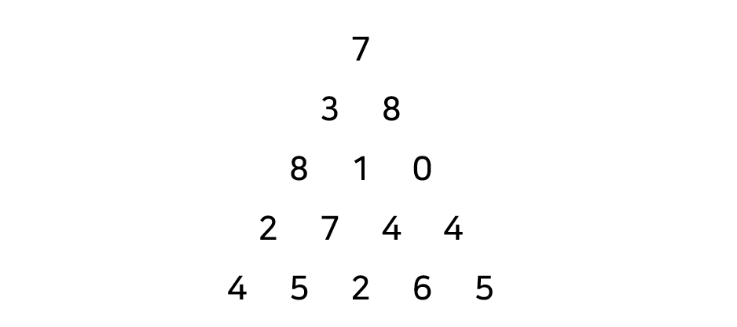

## 문제

BOJ 1932번 : [정수 삼각형](https://www.acmicpc.net/problem/1932)

## 접근 방법

다음과 같이 정수로 이루어진 삼각형이 있다. 위에서 부터 숫자를 밟고 내려온다고 할 때 각 위치에서 왼쪽 혹은 오른쪽으로 이동할 수 있다. 그렇게 이동하여 끝에 다달았을 때 **지금까지 밟고 온 수들의 합의 최대값**을 구하는 문제이다.



### 설명

[RGB 거리](../boj-1149-rgb-street)에서 언급했다 싶이 **현재를 기준으로 과거를 추측**해야 한다. 내가 현재 이 숫자까지 왔는데 <u>이 숫자까지 어떻게 왔는지</u>를 추측해야 한다.

위의 삼각형을 예시로 하면 마지막 줄의 2까지 오기 위해서는 바로 위의 7혹은 4를 밟고 와야한다. 이 때 7까지와 4까지 왔을 때 지금까지 밟았던 수들의 합을 비교하여 가장 큰 수에다가 현재 밟으려는 숫자를 더하면 된다!

### 결론

$i$번째 줄의 $k$번째 숫자를 밟는다고 할 때, $i-1$번째 줄의 $k-1$번째 숫자나 $i-1$번째 줄의 $k$번째 숫자를 밟고 왔을 것이다. 그 둘 중 가장 큰 값을 가진 것을 선택하고 $i$번째 줄의 $k$번째 숫자를 더해주면 **지금 밟고 있는 숫자까지의 최대값**을 얻을 수 있다. 이를 점화식으로 정리하면 다음과 같다.

$$
sum[i][k] = max(sum[i-1][k-1], sum[i-1][k]) + num[i][k]
$$

- $sum[i][k]$ : $i$번째 줄의 $k$번째 수까지의 밟고 온 숫자들의 합
- $num[i][k]$ : 정수 삼각형의 $i$번째 줄의 $k$번째 수

## 교훈

**동적계획법 키워드**로 다음을 꼭 기억하자!

- 현재에 오기위해 바로 직전에 내가 어떻게 해야 현재로 올 수 있는지 생각한다.
- 과거와 현재와의 연관성을 `점화식`을 통해 나타낸다.

## 소스 코드

```python
import sys


N = int(sys.stdin.readline())
table = [[0] * (N+1) for _ in range(N+1)]
for i in range(1, N+1):
  row = list(map(int, sys.stdin.readline().split()))
  for j in range(1, i+1):
    table[i][j] = max(table[i-1][j-1], table[i-1][j])+row[j-1]

print(max(table[N]))
```
