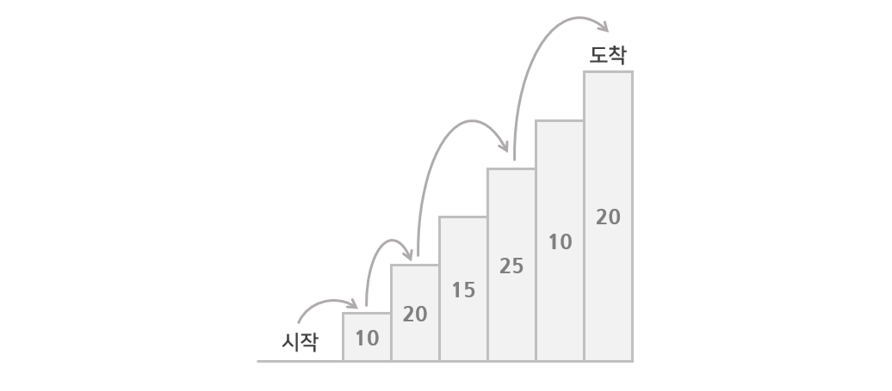

## 문제

BOJ 2579번 : [계단 오르기](https://www.acmicpc.net/problem/2579)

## 접근 방법



계단을 오를 때 **밟는 계단에 써져있는 수의 합의 최대값**을 구하는 문제이다. 계단을 오르는 방법은 다음과 같다. 계단의 시작점은 첫 번째 계단이 아닌 완전 바닥부터 시작한다. 즉, 첫 번째 계단은 시작점이 아니다.

- 계단은 한 번에 한 계단씩 또는 두 계단씩 오를 수 있다.
- 연속된 세 개의 계단을 모두 밟아서는 안 된다. 단, 시작점은 계단에 포함되지 않는다.
- 마지막 도착 계단은 반드시 밟아야 한다.

### 설명

위의 계단을 예로 생각해보자. 내가 도착지점인 $20$에 도착했을 때 **어떻게 $20$에 도착할 수 있을까?**

만약 한 계단 올라서 온 경우라면 그 직전 계단인 $10$을 밟았을 것이다. 연속된 3개의 계단을 밟을 수 없으므로 $10$을 기준으로 전전 계단인 $15$를 밟고 왔을 것이다. 즉, `15 → 10 → 20`으로 밟고 왔을 것이다.

두 계단을 올라서 온 경우면 그 전전 계단인 $25$를 밟고 왔을 것이다. 즉, `25 → 20`을 밟고 왔다.

### 결론

계단의 개수가 2개 이하인 경우 <u>계단을 모두 밟는 경우</u>가 최대값이 된다. 계단의 개수가 3개일 경우 <u>1번째 계단과 2번째 계단 중 큰 값과 3번째 계단의 합</u>을 반환하면 된다.

계단의 개수가 4개 이상인 경우 앞의 과정을 반복하면 된다. 즉, <u>한 계단을 올라온 경우와 두 계단을 올라온 경우 중 가장 큰 수를 저장</u>하면서 계단을 오르면 된다. 이를 점화식으로 나타내면 다음과 같다.

$$
sum[i] = max(stair[i]+stair[i-1]+sum[i-3], stair[i]+sum[i-2])
$$

- $sum[i]$ : $i$번째 계단까지 밟았을 때의 밟고 지나온 숫자들의 합
- $stair[i]$ : $i$번쨰 계단에 적힌 수

## 교훈

**시작점에서 두 칸을 오를 수 있는 건지**가 헷갈렸었다. 문제에 따로 명시되지 않은 것을 보니 가능하다는 것을 알 수 있었다. 문제의 제한사항을 빠른 시간 내에 파악하는 연습이 필요한 것 같다.

## 소스 코드

```python
import sys

def result(stair, n):
    if len(stair) < 3:
        return sum(stair)

    table = [stair[0], max(stair[1], stair[0]+stair[1]), max(stair[0], stair[1])+stair[2]]
    for i in range(3, n):
        table.append(max(stair[i]+stair[i-1]+table[i-3], stair[i]+table[i-2]))

    return table[-1]


n = int(sys.stdin.readline())
stair = []
for _ in range(n):
  stair.append(int(sys.stdin.readline()))
print(result(stair, n))

```
