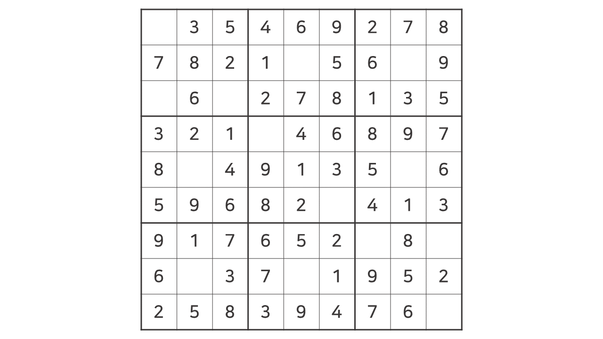

## 문제

BOJ 2580번 : [스도쿠](https://www.acmicpc.net/problem/2580)

## 접근 방법

[N-Queen](../boj-9663-n-queen) 문제와 비슷한 `백트래킹` 문제이다. 백트래킹의 개념은 이해했지만 그걸 구현하는 것이 익숙하지 않아서 결국 다른 분들의 풀이를 참고하였다. 다음의 풀이는 [Kim Dojin님의 풀이](https://dojinkimm.github.io/problem_solving/2019/10/16/boj-2580-sudoku.html)를 참고한 것이다!

저번 [N-Queen](../boj-9663-n-queen) 문제를 떠올려보자. 각 행에 퀸이 하나씩 위치할 수 있으며 퀸의 **위치**를 바꿔가면서 <u>퀸이 이 위치에 있을 때 다른 퀸과 상하 혹은 대각선 방향으로 겹치는지</u>를 체크하였다. 이를 동일하게 적용하면 된다.



[스도쿠](https://www.acmicpc.net/problem/2580) 문제는 각 빈칸에 1부터 9가지의 수를 넣을 수 있으며 **숫자**를 바꿔가면서 <u>가로줄, 세로줄, 3×3 그룹에서의 합이 모두 9인지</u>를 체크하면 된다. 이것을 그대로 구현하면 다음과 같다.

- **왼쪽 위의 빈칸부터 차례대로 숫자를 넣는다.** 숫자는 1부터 9까지의 자연수만 가능하다.
- 1부터 9까지의 수를 차레대로 넣어가며 **가로줄, 세로줄, 3×3 그룹에서의 합이 모두 9인지** 체크한다.
  - 만약 그렇다면 빈칸에 그 숫자를 집어넣는다.
  - 그렇지 않다면 다음 숫자를 넣고 다시 체크한다.
- 다음 빈칸으로 이동하여 똑같은 과정을 실행한다.
- 모든 빈칸을 채웠다면 `board`를 출력하고 프로그램을 종료시킨다.

<br>

> 스도쿠 코드가 잘 구현되었는지 확인하는 방법은 **스도쿠 보드를 모두 빈칸으로 두고 넣어보는 것**이다. 제대로 구현되지 않았다면 출력 보드에 빈칸이 숭숭 나있을 것이다.

## 교훈

`백트리킹`의 구현은 **재귀와 유망함수**가 다라는 생각이 든다. **유망함수**는 이 경우가 유망한지를 체크하기 위함이고 **재귀**는 DFS와 가지치기(그래서 다시 초기화를 한다)를 하기 위함이라고 생각한다. 이 2개의 키워드를 잘 기억해놔야겠다.

## 소스 코드

```python
import sys

# 가로축 검사
def row_check(row, value):
  if value in board[row]:
    return False
  return True

# 세로축 검사
def col_check(col, value):
  for _ in range(9):
    if value == board[_][col]:
      return False
  return True

# 3*3 그룹 검사
def group_check(row, col, value):
  from_row = row//3 * 3
  from_col = col//3 * 3
  for i in range(3):
    for j in range(3):
      if value == board[from_row+i][from_col+j]:
        return False
  return True


def sudoku(idx):
  # 모두 채웠다면 출력 및 종료
  if idx == len(blanks):
    for row in board:
      print(' '.join(map(str, row)))
    sys.exit()
  else:
    # 1-9의 값을 하나씩 넣어보며 검사
    for val in range(1, 10):
      # 빈 칸의 위치
      idx_x = blanks[idx][0]
      idx_y = blanks[idx][1]

      # 해당 값으로 채워도 문제가 없다면
      if row_check(idx_x, val) and col_check(idx_y, val) and group_check(idx_x, idx_y, val):
        # 해당 값으로 채우기
        board[idx_x][idx_y] = val
        # 다음 빈칸으로 이동
        sudoku(idx+1)
        # 다시 돌아올 것에 대비해 초기화
        board[idx_x][idx_y] = 0


board = list()
for _ in range(9):
  board.append(list(map(int, input().split())))
# 빈칸의 위치 저장
blanks = list()
for i in range(9):
  for j in range(9):
    if board[i][j] == 0:
      blanks.append((i, j))
sudoku(0)
```
