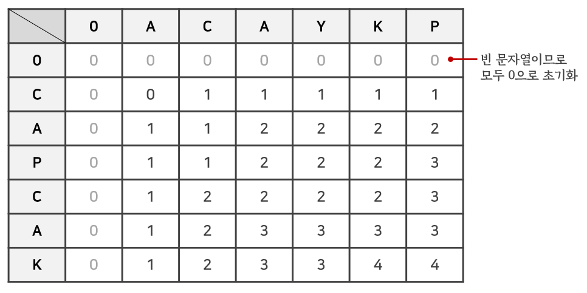

> 잘못된 부분이 있다면 친절히 말씀해주시면 감사하겠습니다🙏

## 문제

BOJ 9251번 : [LCS](https://www.acmicpc.net/problem/9251)

## 접근 방법

영어 대문자로 이루어지고 같은 길이의 문자열 2개가 주어졌을 때, 두 문자열의 **최장 공통 부분 수열(Longest Increasing Subsequence, LCS)**을 구하는 문제이다.

### 예시

문제의 예시인 `CAPCAK`와 `ACAYKP`를 가지고 생각해보자. 이 때 공통 부분 수열을 어떻게 파악할 수 있을까? 바로 첫 문자부터 시작해 하나씩 대상을 넓혀가면서 <u>마지막 문자</u>를 비교하고 <u>그 문자가 없기 전의 상황</u>을 살펴보면 된다.

#### 마지막 문자가 같은 경우

`CA`와 `ACA`의 상황에서 마지막 문자는 `A`임을 확인할 수 있다. 과거의 상황이 어찌되든 간에 최장 공통 부분 수열의 길이는 **최소 1 이상**이다. 그럼 과거의 상황은 언제일까? `C`와 `AC`인 상황이다. 이 때의 최장 공통 부분 수열의 길이에 **+1**을 해주면 `CA`와 `ACA`의 공통 부분 수열 길이를 구할 수 있다

#### 마지막 문자가 다른 경우

`ACA`와 `CAP`의 상황에서 마지막 문자는 각각 `A`와 `P`이므로 다르다. 이 경우는 마지막 문자는 고려하되 두 문자가 다르므로 **두 경우 중 가장 큰 경우**를 가져온다. 그 경우가 바로 `AC`와 `CAP`인 경우와 `ACA`와 `CA`이다. 전자는 최장 길이가 1이고 후자는 2이므로 가장 큰 값인 **2**가 `ACA`와 `CAP`의 최장길이가 된다.

### 결론

모든 경우의 수를 테이블로 나타내면 다음과 같다. 각 행과 열은 **문자열**을 나타내며 각 칸은 각 문자열을 행과 열의 값까지 제한할 때의 **최장 공통 수열의 길이**이다. 예를 들면, (3, 3)이면 `CAP`와 `ACA`일 때의 최장 공통 수열의 길이를 말한다.



정리하면 제약사항인 문자열의 길이에 따라 **최장 공통 수열의 길이**를 갱신하면 된다. 즉, 현재 각 문자열의 마지막 문자를 비교하여 같은지 파악한다. 만약 같다면 <u>바로 그 전 상황의 최장 길이에 +1</u>을 하고, 같지 않다면 <u>다른 두 문자를 각각 포함하지 않은 경우 중 큰 경우의 값</u>을 가져오면 된다.

위의 테이블을 점화식으로 나타내면 다음과 같다.

- 마지막 문자가 같은 경우 : $table[i][j] = table[i-1][j-1] + 1$
- 마지막 문자가 다른 경우 : $table[i][j] = max(table[i][j-1], table[i-1][j])$

## 교훈

제약사항을 풀어간다고 생각했지만 동적계획법의 본질은 **큰 문제를 작은 문제로 쪼개는 것**이다. 이를 항상 염두해두고 제일 최소 단위로 쪼갰을 때 어떻게 현재의 문제를 해결할 수 있는지 생각하자.

## 소스코드

```python
seq1, seq2 = input(), input()
l1, l2 = len(seq1), len(seq2)
table = [[0]*(l2+1) for _ in range(l1+1)]

for i in range(1, l1+1):
  for j in range(1, l2+1):
    # 마지막 문자가 같은 경우
    if seq1[i-1] == seq2[j-1]:
      table[i][j] = table[i-1][j-1] + 1
    # 마지막 문자가 다른 경우
    else:
      table[i][j] = max(table[i-1][j], table[i][j-1])

print(table[l1][l2])
```
