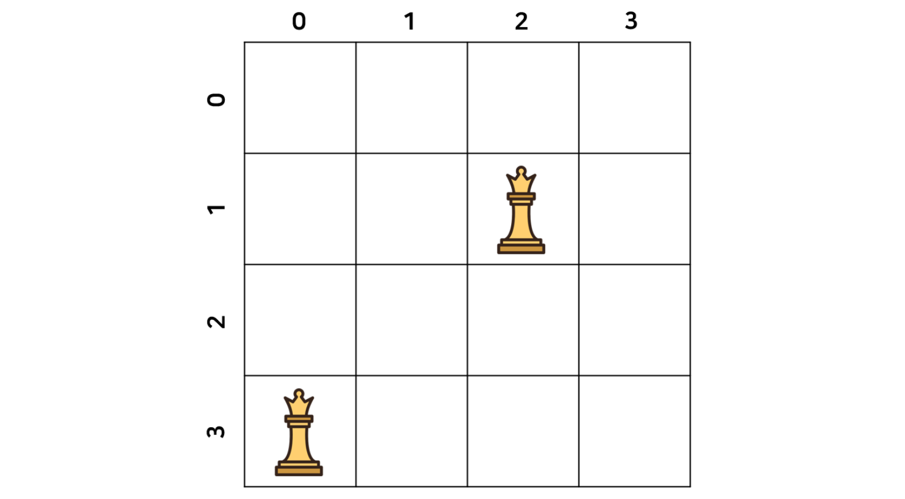
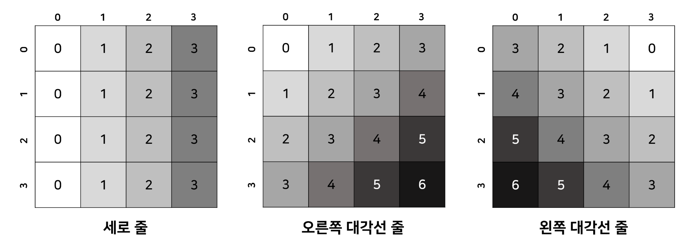

> 잘못된 부분이 있다면 친절히 말씀해주시면 감사하겠습니다🙏

## 문제

BOJ 9663번 : [N-Queen](https://www.acmicpc.net/problem/9663)

## 접근 방법

백트래킹의 가장 대표적인 문제인 N-Queen 문제이다. 알고리즘은 작년에 수강했는데 기억이 잘 안나서 [알고리즘 기초](http://www.yes24.com/Product/Goods/37582683) 책을 찾아서 개념을 읽고 구현했다. 근데 잘 안 돌아가서 다른 분들의 풀이를 참고하였다.

### 방법 1.

N-Queen의 가장 흔한 풀이이다. 풀이는 [파이리썬의 파이썬 Claude_U](https://claude-u.tistory.com/245)님의 풀이를 참고하였다!

- **0부터 N-1 열까지 퀸을 1개씩 놓는다.** 그래야 N개의 퀸을 배치할 수 있다.
- 차례로 퀸을 놓으면서 이 퀸의 위치가 **유망한지(promising)** 검사를 한다.
  - 유망하지 않다면 해당 퀸을 옆칸으로 옮긴다.
  - 유망하다면 해당 퀸을 고정시키고 다음 열로 넘어가 다른 퀸을 다시 0부터 검사한다.

<br>

기본적인 뼈대는 이렇다. 그럼 **유망하다**는 것이 무슨 의미일까? 유망하다라는 것은 <u>이 경우가 우리가 원하는 경우이냐</u>를 말한다. 여기서는 <u>퀸을 이렇게 배치했을 때 퀸이 영향받지 않느냐</u>이다. 퀸은 상하좌우, 대각선 모든 방향으로 움직이므로 다음의 조건을 만족하면 **유망하지 않다**라고 판단한다.

- `상하` : 열이 같을 때
- `대각선` : 행에서의 차이가 열에서의 차이와 같을 때

<br>

`대각선`의 경우를 이해하기 위해 예시를 들어보자. 다음은 `4x4`의 체스판이다. 현재 2개의 퀸이 놓여진 상태이고 이 퀸은 현재 같은 대각선 상에 위치한다. 편의를 위해 1부터가 아닌 0부터 센다.



위에서 부터 순서대로 각 퀸의 위치는 (1, 2)와 (3, 0)으로 표현된다. 이 때 두 퀸의 행에서의 차이는 2이고, 열에서의 차이도 동일하게 2이다. **행과 열의 차이가 같은지**를 이용하면 두 퀸이 같은 대각선 상에 있는지 알 수 있다.

### 방법 2.

상하좌우 대각선을 루프를 돌려 확인하는 것은 매우 비효율적이다. 그래서 이를 보완한 풀이가 다음의 풀이이다. 이 풀이는 [레바스](https://rebas.kr/761)님의 풀이를 참고하였다.

상하좌우 대각선을 확인하기 위해 세로 줄`|`, 오른쪽 대각선 줄`\`, 왼쪽 대각선 줄 `/`을 체크하기 위한 배열을 선언한다. 이 배열은 퀸의 위치가 $(x, y)$일 때의 **같은 선상에 있는지를 확인해주는 지표**이다.

- 세로 줄 `|`: $y$
- 오른쪽 대각선 줄 `\`: $x+y$
- 왼쪽 대각선 줄 `/`: $x-y+N-1$

예를 들어 `4x4` 체스판에 위의 식을 적용하면 다음과 같다. 만약 같은 선상에 위치하면 같은 값을 갖게 된다.



### 방법 3.

[레바스](https://rebas.kr/761)님의 풀이에 소개된 또 다른 방법으로 야매로 푸는 방법이다ㅋㅋㅋ 이 문제의 입력 범위는 1에서 15로, 15가지 경우의 수를 다 구해서 입력에 따라 해당하는 값을 반환하면 된다.

## 소스 코드

### 방법 1.

```python
import sys

def queens(i):
  global count
  # 모든 행을 다 돌았을 때
  if i == N:
    count += 1
  # 다 돌지 못한 경우
  else:
    #해당 행의 열을 탐색
    for j in range(N):
      col[i] = j
      if promising(i):
        queens(i+1)

def promising(i):
  for k in range(i):
    # 같은 열 혹은 같은 대각선에 있는 경우
    if (col[i] == col[k]) or (abs(col[i]-col[k])==i-k):
      return False
  return True

N = int(sys.stdin.readline())
col = [0]*N
count = 0
queens(0)
print(count)
```

### 방법 2.

```python
import sys

n = int(sys.stdin.readline())
count = 0
vert, diag, rev_diag = [False]*n, [False]*(2*n-1), [False]*(2*n-1)


def queens(i):
  global count
  # 체스판 모든 행을 돈 경우
  if i == n:
    count += 1
    return
  # 아닌 경우 해당 행의 모든 열 루프
  for j in range(n):
    # 상하, 왼쪽/오른쪽 대각선 모두 퀸이 없는 경우
    if not(vert[j] or diag[i+j] or rev_diag[i-j+n-1]):
      # 해당 행의 열에 퀸 위치 고정
      vert[j] = diag[i+j] = rev_diag[i-j+n-1] = True
      # 다음 행으로 이동
      queens(i+1)
      # 다시 초기화
      vert[j] = diag[i+j] = rev_diag[i-j+n-1] = False


queens(0)
print(count)
```

### 방법 3.

```python
import sys

queens = [0, 1, 0, 0, 2, 10, 4, 40, 92, 352, 724, 2680, 14200, 73712, 365596]
print(queens[int(sys.stdin.readline())])
```
