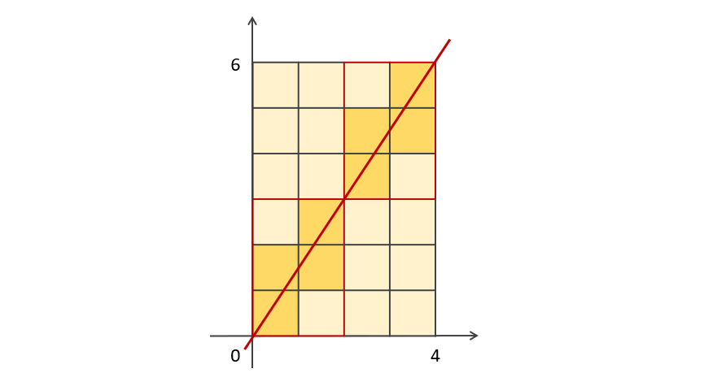

## 문제

PROGRAMMERS Level 2 - [멀쩡한 사각형](https://programmers.co.kr/learn/courses/30/lessons/62048)

## 접근 방법

내가 처음 구현했던 풀이는 $(0, 0)$과 $(w, h)$를 잇는 직선의 방정식을 만들어 $k$가 자연수 일 때 $y = k$일 때의 $x$좌표를 구해 제외해야하는 사각형을 구했다. 하지만 이렇게 풀면 시간초과가 난다.

결국 풀지 못해서 [슈퍼짱짱님의 풀이](https://leedakyeong.tistory.com/entry/%ED%94%84%EB%A1%9C%EA%B7%B8%EB%9E%98%EB%A8%B8%EC%8A%A4-%EB%A9%80%EC%A9%A1%ED%95%9C-%EC%82%AC%EA%B0%81%ED%98%95-in-python)를 참고했다. 설명을 정말 잘 해주셔서 내 설명보다는 이 분의 설명을 읽는 것을 더 추천하다!

### 설명



너비가 4이고 높이가 6인 사각형이 있다. 이 사각형의 왼쪽 아래를 $(0, 0)$으로 두고 $(0, 0)$과 $(4, 6)$을 지나는 선을 그리면 다음과 같다. 이 선은 $(0, 0)$과 $(4, 6)$외에도 $(2, 3)$도 지난다.

이 때 원점을 제외한 직선이 지나는 점(= 빨간 사각형)의 개수는 2개 즉, **4와 6의 최대공약수**임을 알 수 있다.

### 결론

**$w$와 $h$의 최대공약수가 1인 경우** 직선이 지나는 점은 $(0, 0)$과 $(w, h)$외에는 없다. 즉 <u>사각형 전체가 빨간 사각형이 된다.</u> 이 사각형에 대각선을 그리면 너비와 높이의 개수 만큼의 사각형을 지난다. 이 때 공통으로 지나는 사각형이 있으므로 1을 빼면, 제외되는 사각형의 개수는 $w+h-1$이 된다.

**$w$와 $h$의 최대공약수가 1보다 클 때**는 앞의 예시처럼 <u>최대공약수의 개수만큼의 빨간색 사각형이 존재한다.</u> 이 때 이 빨간색 사각형의 최대공약수는 **1**이므로 앞의 공식을 이용하여 빨간 사각형 내에서 제외되는 사각형의 개수를 구하고 빨간색 사각형의 개수만큼 곱해주면 된다. 즉, $w$와 $g$의 최대공약수가 $gcd$일 때, 제외되는 사각형의 개수는 $gcd * (w/gcd + h/gcd - 1) = w + h - g$이다.

## 교훈

여러 모양의 사각형을 그려보면서 규칙을 구하려 했는데 눈에 보이는 규칙이 없어서 결국 다른 분의 풀이를 참고하였다. 알고리즘 문제라기 보다는 **수학** 문제에 가까운데 여태까지 풀었던 수학 문제 중 `최대공약수`와 `최소공배수`를 이용한 문제들이 꽤 있었다. 비슷한 문제가 나온다면 `최대공약수`나 `최소공배수`를 의심해봐야겠다.

## 소스 코드

```python
import math

def solution(w,h):
    gcd = math.gcd(w, h)
    if gcd == 1:
        return w*h-(w+h-1)
    return w*h-(w+h-gcd)
```
