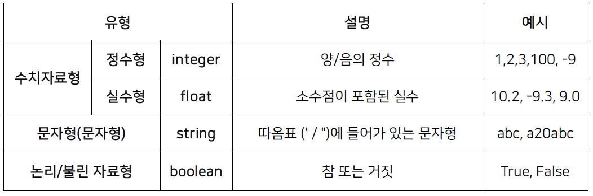
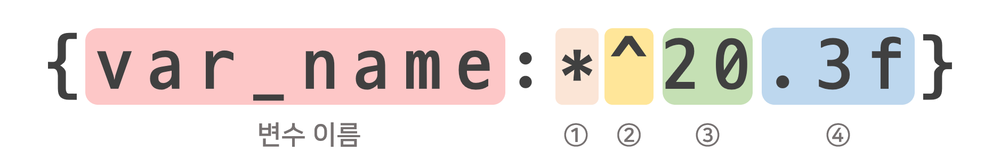

> [부스트캠프 AI Tech](https://boostcamp.connect.or.kr/program.html)의 강의를 참고하여 작성한 포스트입니다.

## Table of Contents

- [변수](#변수)
- [문자열](#문자열)
- [References](#references)

## 변수

변수는 **데이터를 저장하기 위한 메모리 공간의 프로그래밍상 이름**이다.

- 변수를 선언하고 할당하는 순간 운영체제에 메모리 할당을 요청하여 할당된 공간에 값을 저장한다.
- 즉, 변수에 있는 값은 메모리의 주소이다.

### 기본(원시) 자료형



파이썬이 처리할 수 있는 데이터 유형으로 **각 유형별 메모리에 차지하는 공간 크기**가 다르다.

- 파이썬은 동적 타이핑 언어로 변수의 자료형은 값이 할당되는 순간 결정된다.
- 자료형마다 할당되는 크기다 다르므로 **표현 볌위**도 다르다.

### 변수의 범위

- `지역 변수`: 함수 내
- `전역 변수`: 프로그램 전체

#### 함수에 전역변수와 같은 이름의 지역변수가 있는 경우

이럴 경우 전역변수보다는 지역변수가 우선이 된다.
만약 전역 변수를 쓰고 싶다면은 변수 이름 앞에 `global` 키워드로 명시해주면 된다.

#### global 키워드는 언제 쓰일까?

기본적으로 전역변수는 기본적으로 `global`이다. 그러므로 함수 내에서 `global` 키워드 없이 전역변수를 사용할 수 있다.
다만 전역변수를 수정하는 경우 `global`로 꼭 명시를 해주어야 한다.

자세한 내용은 [여기](https://www.programiz.com/python-programming/global-keyword)를 참고!

## 문자열

- 시퀀스 자료형으로 문자열 데이터를 메모리에 저장한다.
- 영문자 한 글자는 **1 Byte**의 메모리 공간을 사용한다.
- 리스트처럼 인덱싱과 슬라이싱이 가능하다.
- 문자열 메서드는 [여기](https://www.w3schools.com/python/python_ref_string.asp)를 참고!

<div class="quote-block-simple">
<div class="quote-block-simple__emoji">💡</div>
<div class="quote-block-simple__content" markdown=1>

이스케이프 시퀀스도 그대로 출력하고 싶다면 `r"문자열"`인 **raw string**을 사용하면 된다.

</div>
</div>

### 포맷팅 종류

```python
integer = 10; string = "Hi!"; real = 3.14

# 방법 1. % string (옛날 방법)
print("정수: %d, 문자열: %s, 실수: %.2f" % (integer, string, real))
# 방법 2. format 함수
print("정수: {0}, 문자열: {1}, 실수: {2:.2f}".format(integer, string, real))
# 방법 3. f-string (대세)
print(f"정수: {integer}, 문자열: {string}, 실수: {real:.2f}")
```

### 포맷팅 옵션

f-string 기준으로 다음과 같이 `:` 다음에 포맷팅 옵션을 넣어줄 수 있다.



- ① 빈칸에 채울 문자열
- ② `<` 왼쪽 정렬(기본), `>` 오른쪽 정렬, `^` 가운데 정렬
- ③ 숫자를 넣은 칸의 수
- ④ 소수점 몇 자리까지 할건지

## References

- [Python Global Keyword](https://www.programiz.com/python-programming/global-keyword)
- [List Methods](https://www.w3schools.com/python/python_ref_list.asp)
- [String Methods](https://www.w3schools.com/python/python_ref_string.asp)
