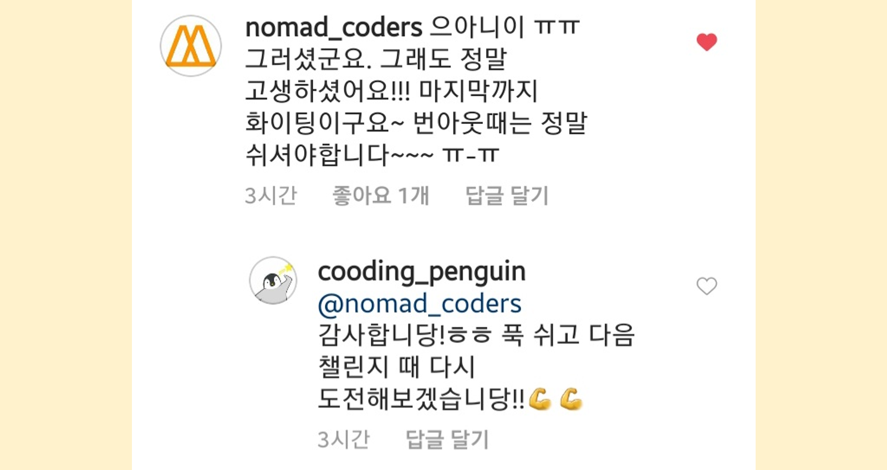

> TIL의 형식은 [초보몽키의 개발공부로그](https://wayhome25.github.io/)를 참고하였습니다.

## TIL

- [2020년 8월 10일](#2020년-8월-10일)
- [2020년 8월 11일](#2020년-8월-11일)
- [2020년 8월 12일](#2020년-8월-12일)
- [2020년 8월 13일](#2020년-8월-13일)
- [2020년 8월 14일](#2020년-8월-14일)
- [2020년 8월 15일](#2020년-8월-15일)

## 2020년 8월 10일

### ✅ 오늘 할 일

- ~~백준 단계별 알고리즘 수학 - BOJ1929 소수구하기~~ ⭕
- ~~프로그래머스 Level1 - 직사각형 별찍기~~ ⭕
- ~~KOOC 데이터 구조 및 분석 OT~~ ⭕
- Porto Seguro by bertcarremans 필사 1차 🔺
- Airbnb Django 강의 #0, #1 ❌

### ✨ 오늘 한 일

- **소수 구하기 알고리즘을 다시 상기시켰다.**
  - 나중에 블로그 포스팅으로 한 번 정리를 해야겠다.
  - 그리고 `크거나 같다`, `작거나 같다` 일 경우 해당 수를 포함했는지 안 했는지 확실히 확인할 것!
- **Porto Seguro by bertcarremans를 EDA 중간까지 했다.**
  - 데이터의 유형에 따라 데이터의 Meta DataFrame을 만든 것이 신박했다. 확실히 Meta 데이터가 있다보니 피처 추출이 훨씬 쉬워졌다.
  - smoothing 방식으로 unique value가 많은 categorical 피처를 encoding하였다. 근데 무슨 말인지는 모르겠다.. 참고할 수식 조차 없다. 논문을 읽는 걸 도전해봐야 겠다.

### 💡 내일 할 일

- 백준 단계별 알고리즘 수학 - BOJ4948 베르트랑 공준
- 프로그래머스 Level1 - 행렬의 덧셈
- KOOC 데이터 구조 및 분석 #1.1 - #1.5
- Porto Seguro by bertcarremans 필사 1차 끝내기
- Porto Seguro by bertcarremans 필사 2차
- 파이썬 웹 프로그래밍 - 1장. 웹 프로그래밍의 이해

### ✍ 메모

- 클론 코딩으로 Django를 하려 했는데 이번 react 챌린지를 포기하고 나니 약간의 깨달음을 얻었다. **챌린지가 결코 쉬운 게 아니라는 것**과 **클론 코딩으로 개념을 커버하기는 무리라는 것.** 확실히 클론 코딩은 실전으로 무언 갈 하기는 좋지만은 깊이있는 개념을 얻기에는 조금 부족한 것 같다.
- Django 챌린지를 앞두고 있는데 이번 챌린지는 포기하고 클론 코딩 강의를 듣기 전에 간단히 [파이썬 웹 프로그래밍](http://www.yes24.com/Product/Goods/63503495) 책으로 Django 개념을 다지고 가려 한다. 아마 이제부터는 `책으로 개념잡기 → 클론 코딩 → 챌린지` 순으로 가지 않을까 싶다.
- TIL Wiki라고 호기롭게 만들었는데 결국에는 블로그로 돌아왔다. 가장 큰 이유는 **굳이 2가지의 플랫폼을 추구하야할 이유**가 없었다. 두 플랫폼의 큰 차이를 못 느껴서 블로그에 적으려 한다. 다만 `검색기능`이 없다는 게 너무 아쉬워서.. 일단 테마 업데이트를 기다리지만은 중간에 내가 할 수 있다면 검색기능을 추가할 예정.

 

<a href='#'><small class='up-button'>위로 올라가기💨</small></a>

 

## 2020년 8월 11일

### ✅ 오늘 할 일

- ~~백준 단계별 알고리즘 수학 - BOJ4948 베르트랑 공준~~ ⭕
- ~~프로그래머스 Level1 - 행렬의 덧셈~~ ⭕
- KOOC 데이터 구조 및 분석 #1.1 - #1.5 ❌
- Porto Seguro by bertcarremans 필사 1차 끝내기 ❌
- Porto Seguro by bertcarremans 필사 2차 ❌
- 파이썬 웹 프로그래밍 - 1장. 웹 프로그래밍의 이해 ❌

### ✨ 오늘 한 일

- **백준 베르트랑 공준과 프로그래머스 쉬운 문제 하나를 풀었다.**
  - 소수 구하는 문제는 한 번 정리해놓으면 쉽게 풀 수 있을 것 같다.
  - 행렬 덧셈하는 걸 이중 for문으로 해결했는데 다른 사람들 보니까 `zip`을 사용해서 거의 두 줄로 풀던데.. 역시 [중급 파이썬](http://www.yes24.com/Product/Goods/81519650)을 빨리 봐야겠당
- **인스타그램에 [<8월 둘째 주: 내 노력을 인정하자>](https://www.instagram.com/p/CDv4cHtl8DG/)라는 글을 올렸다.**
  - 이제 겨우 각각의 플랫폼의 역할을 확실시했다.
  - **인스타그램**은 한 주차의 짧은 회고나 내가 한 일의 후기를 올릴 것이다.
  - **블로그**는 무조건 내가 직접 쓰거나 정리한 글을 올린다. (정리일 경우 꼭 <u>출처</u> 남김!)
  - **Notion**은 개인 공부하면서 짧게 메모하거나 공부한 걸 정리할 것이다.

### 💡 내일 할 일

- 백준 단계별 알고리즘 수학 - BOJ9020 골드바흐의 추측
- 프로그래머스 Level 1 - 수박수박수박수박수박수?
- Porto Seguro by bertcarremans 필사 1차 끝내기
- Porto Seguro by bertcarremans 필사 2차

### ✍ 메모

일단은 내일 할 일에는 없지만 **KOOC 데이터 구조 및 분석**을 들을 수도 있다. 사실은 이번 달에 계획한 건 너무너무 많았는데.. 지금 번아웃🔥이 와버려서 아슬아슬하다. 일단 Kaggle 스터디 모임을 하고 있어서 이거는 절대로 뺄 수 없고. 그렇다고 코딩을 안 하자니 손이 심심해서 알고리즘 문제만 하루에 간단히 2개씩 풀려고 한다. 지금 이것도 정말정말 많이 뺀 거다.

**노마드코더의 Lynn님**의 응원을 듣고 힘을 조금 얻었다! 번아웃 때는 푹 쉬어야 한다는 조언에 최대한 뺄 수 있는 걸 뺐다. 사실 Kaggle 스터디만 하는 걸로 지금은 많이 벅차서 일단 <u>8월은 내 몸과 정신을 회복하는데 집중</u>해야 겠다. 아에 당분간은 집 책장에서 컴퓨터 서적을 치워버려야지ㅋㅋㅋ

 

<a href='#'><small class='up-button'>위로 올라가기💨</small></a>

 

## 2020년 8월 12일

### ✅ 오늘 할 일

- ~~백준 단계별 알고리즘 수학 - BOJ9020 골드바흐의 추측~~ ⭕
- ~~프로그래머스 Level 1 - 수박수박수박수박수박수?~~ ⭕
- ~~Porto Seguro by bertcarremans 필사 1차 끝내기~~ ⭕
- Porto Seguro by bertcarremans 필사 2차 ❌

### ✨ 오늘 한 일

- **골드바흐의 추측 문제와 프로그래머스의 수박x5수를 풀었다.**
  - 특정 수를 구하는 문제에서는 <u>무조건 입력 범위를 확인하는 습관</u>을 들여야겠다.
  - [BOJ9020 골든바흐의 추측](https://cooding-penguin.netlify.app/problem-solving/boj-9020-goldbach-conjecture/) 게시글에는 써있지 않지만은 내가 사용한 방법은 매우 비효율적이다.. 왜냐하면 매 test case마다 소수들을 생성하기 때문이다. 그래서 실행 시간이 오래걸렸던 것 같다!
  - 프로그래머스 문제는 그렇게 어렵지 않아서.. 딱 두 줄로 끝냈다!😊
- **bertcarremans의 Porto Seguro 첫 번째 필사를 마쳤다.**
  - 아직도 smoothing effect가 unique value가 많은 categorical feature에 어떤 효과가 있는지 모르겠다. 노트북의 저자가 써놓지를 않아서.. 논문도 봤는데 잘 모르겠다.
  - 이 데이터셋은 **feature에 대한 정보를 숨겨놓은 데이터셋**이다. 그래서 더 <u>피처를 골라내는 인사이트</u>를 얻을 수 있었다. 특히 피처의 종류에 따라 결측치(missing value)를 어떻게 채울지, 어떻게 feature engineering할지 등을 배울 수 있어서 좋았다.
  - **SimpleImputer**라는 것도 처음 알았는데 결측치를 쉽게 채울 수 있는 클래스이다! `평균`, `중간값`, `최빈값`, `상수` 중 하나를 지정할 수 있다.

### 💡 내일 할 일

- 백준 단계별 알고리즘 수학 - BOJ1085 직사각형에서 탈출
- 프로그래머스 Level 1 - 평균 구하기
- Porto Seguro by bertcarremans 필사 2차
- Porto Seguro by bertcarremans 필사 3차

### ✍ 메모

백준과 프로그래머스 문제 한 개씩 푸는 것 만으로도 만족감을 느끼고 있다. 번아웃이 가시면 문제 개수를 늘려봐야지! 근데 지금 남은 백준의 **수학2** 문제들이 다 `브론즈🥉` 등급이라서 하루에 한 개가 아니라 여러 개 풀 수도 있다. 사실 프로그래머스 Level 1도 엄청 쉬워서 다 풀어도 되는데 일단은 지금 이대로가 괜찮은 것 같다.

내가 너무 시간이 없다고 생각하지말고 **✨길게 보는 습관✨**을 들여야겠다. 왜 이렇게 조급한지.. 휴학도 휴학인데 꼭 공부/취업을 위한 휴학만 존재해야하는지는 모르겠다. 알차게 쉬는 것도 휴학이라고 생각하는데.. 그것보다 내가 제대로 쉬어본 적이 없어서 어떻게 쉬는 게 쉬는 건지를 잘 모르겠다. 생산적인 일을 하지 않으면 뭔가 마음 깊숙이에서 "이러면 안돼.."라고 외치는 것 같다. 그래도 지금만큼은 최대한 쉬어보자.

 

<a href='#'><small class='up-button'>위로 올라가기💨</small></a>

 

## 2020년 8월 13일

### ✅ 오늘 할 일

- ~~백준 단계별 알고리즘 수학 - BOJ1085 직사각형에서 탈출~~ ⭕
- ~~프로그래머스 Level 1 - 평균 구하기~~ ⭕
- ~~Porto Seguro by bertcarremans 필사 2차~~ ⭕
- ~~Porto Seguro by bertcarremans 필사 3차~~ ⭕

### ✨ 오늘 한 일

- **[백준 직사각형에서의 탈출](https://www.acmicpc.net/problem/1085)과 [프로그래머스 평균 구하기 문제](https://programmers.co.kr/learn/courses/30/lessons/12944)를 풀었다.**
  - 쉬운 문제였지만 뭔가 코드를 짠다는 느낌이 들어서 기분이 좋았다.
  - 쉬운 문제라도 <u>최대한 효율적으로 간단히 짤 수 있는 방법</u>을 생각했다.
- **[Porto Seguro by bertcarremans의 Notebook](https://www.kaggle.com/bertcarremans/data-preparation-exploration) 필사를 끝냈다.**
  - 확실히 두 번째 필사부터 속도가 많이 붙는다.
  - `PolynomialFeatures`를 첫 번째 필사 때는 잘못 이해했는데 지금은 확실히 알았다. 이건 interval/numerical feature에서 **상호작용 피처**를 생성하기 위함이다. 즉, 비선형적인 모델을 상호작용 피처를 만듦으로써 만들 수 있다.
  - 다만 EDA와 Feature Engineering 정도 밖에 없어서 아쉽다. 그 다음 Notebook인 [Porto Seguro Exploratory Analysis and Prediction](https://www.kaggle.com/gpreda/porto-seguro-exploratory-analysis-and-prediction)은 앞서 했던 Notebook의 개선판이어서 더 많이 배울 수 있을 것 같다!

### 💡 내일 할 일

- 백준 단계별 알고리즘 수학 - [BOJ4153 직각삼각형](https://www.acmicpc.net/problem/4153)
- 백준 단계별 알고리즘 수학 - [BOJ3053 택시 기하학](https://www.acmicpc.net/problem/3053)
- 백준 단계별 알고리즘 수학 - [BOJ1002 터렛](https://www.acmicpc.net/problem/1002)
- 프로그래머스 Level 1 - [크레인 인형뽑기 게임](https://programmers.co.kr/learn/courses/30/lessons/64061)
- [Porto Seguro Exploratory Analysis and Prediction](https://www.kaggle.com/gpreda/porto-seguro-exploratory-analysis-and-prediction) 필사 1차
- [Porto Seguro Exploratory Analysis and Prediction](https://www.kaggle.com/gpreda/porto-seguro-exploratory-analysis-and-prediction) 필사 2차
- git에 [git-cz](https://github.com/streamich/git-cz) 적용하기

### ✍ 메모

- 알고리즘 문제가 쉬운 문제일 경우 빨리 넘어가는 게 좋을 것 같다. 약간 쉬운 문제만 푸니까 **아쉬운 느낌**이 살짝 든다ㅎㅎ 그리고 매 알고리즘마다 블로그에 정리하고 있다. 애초에 이렇게 해야하는데 현재 [algorithms repository](https://github.com/CoodingPenguin/algorithms#-%ED%8F%AC%EC%8A%A4%ED%8C%85%ED%95%A0-%EB%AC%B8%EC%A0%9C%EB%93%A4)에 포스팅할 문제들을 모아놨는데 시간 날 때마다 빨리빨리 해야겠다.
- Kaggle Notebook을 하나라도 밀리면 주말에 놀지를 못한다. 정말 **꾸준히 밀리지 않고** 해야겠다. 그리고 <u>모르면 일단 넘어가는 습관</u>을 들여야 겠다. 이게 무슨 말인가 싶지만.. 두 번째, 세 번째 필사하면서 몰랐던 걸 알게 되는 경우가 많아서 첫 번째 필사 때 너무 많은 시간을 들이지 않도록 해야겠다.

 

<a href='#'><small class='up-button'>위로 올라가기💨</small></a>

 

## 2020년 8월 14일

### ✅ 오늘 할 일

- ~~백준 단계별 알고리즘 수학 - [BOJ4153 직각삼각형](https://www.acmicpc.net/problem/4153)~~ ⭕
- ~~백준 단계별 알고리즘 수학 - [BOJ3053 택시 기하학](https://www.acmicpc.net/problem/3053)~~ ⭕
- ~~백준 단계별 알고리즘 수학 - [BOJ1002 터렛](https://www.acmicpc.net/problem/1002)~~ ⭕
- ~~프로그래머스 Level 1 - [크레인 인형뽑기 게임](https://programmers.co.kr/learn/courses/30/lessons/64061)~~ ⭕
- ~~[Porto Seguro Exploratory Analysis and Prediction](https://www.kaggle.com/gpreda/porto-seguro-exploratory-analysis-and-prediction) 필사 1차~~ ⭕
- ~~git에 [git-cz](https://github.com/streamich/git-cz) 적용하기~~ ⭕
- [Porto Seguro Exploratory Analysis and Prediction](https://www.kaggle.com/gpreda/porto-seguro-exploratory-analysis-and-prediction) 필사 2차 ❌

### ✨ 오늘 한 일

- **[BOJ4153 직각삼각형](https://www.acmicpc.net/problem/4153), [BOJ3053 택시 기하학](https://www.acmicpc.net/problem/3053), [BOJ1002 터렛](https://www.acmicpc.net/problem/1002)를 풀어서 백준 수학2 문제집을 다 끝냈다!**
  - 수학 문제라서 그런지 고등학교를 떠오르게 하는 문제들이 주로 나왔다. 위에서 푼 3문제의 경우 `기하`에 해당하는 문제였다.
  - 구현 자체는 그렇게 어렵지는 않았지만 **수학적 지식**이 있어야 풀 수 있는 문제들이었다. [BOJ3053 택시 기하학](https://www.acmicpc.net/problem/3053)의 경우 <u>택시 기하학</u>이 뭔지 모르면 풀 수 없었고, [BOJ1002 터렛](https://www.acmicpc.net/problem/1002)의 경우 <u>원과 원 사이의 거리</u>를 모르면 풀 수 없다.
  - 다행히도 백준에서 관련 개념에 관해서 링크를 걸어놨다! 일단 택시 기하학은 <u>두 점 사이의 거리를 좌표의 절대값 차이</u>로 한다는 것이다. 그래서 원의 정의에 의해 원을 그리게 되면 **마름모(정사각형)**이 나온다. 어느 지점에서 계산하든 거리가 똑같긴 하더라..
  - 터렛은 대충 원 2개 그려가면서 5가지의 경우의 수를 모두 셌는데 고등학교 졸업한지 좀 되서인지..ㅋㅋ 결국 구글링해서 공식 찾아봤다. 공식대로 구현하니 잘 돌아갔다.
- **프로그래머스 [크레인 인형뽑기 게임](https://programmers.co.kr/learn/courses/30/lessons/64061) 문제를 풀었다.**
  - 카카오 코딩테스트 때 출제된 문제라던데 정말로 카카오스러웠다ㅋㅋ
  - Level1이 괜히 Level1이 아니다. <u>주어진 문제의 지시대로</u> 잘 따라가면 원하는 결과가 나온다.
  - 이제 프로그래머스 문제도 블로그에 정리해야 겠다.
- **[Porto Seguro Exploratory Analysis and Prediction](https://www.kaggle.com/gpreda/porto-seguro-exploratory-analysis-and-prediction) 1차 필사를 완료했다!**
  - 손과 어깨와 팔이 너무 아프다. 코드 양이 정말 많다. Notebook에 써져있기로는 4개의 인기 있는 Notebook을 합친거라 한다.
  - 사실 무언가를 배울 수 있다고 너무 기대했는지.. 오히려 기대가 저버렸다. 왜냐하면 4개의 Notebook이 짬뽕이 되어 있어서 코드가 **일관성이 없**었다. 저번에 필사한 Notebook도 있었는데 Metadata를 생성하는 걸 해놨는데 거의 쓰지를 않았다.
  - 조금 알게 된 건 시각화 정도인 것 같다. feature별 distribution을 파악하는 데 좋았다.

### 💡 내일 할 일

- 백준 단계별 알고리즘 재귀 - [BOJ11729 하노이 탑 이동 순서](https://www.acmicpc.net/problem/11729)
- 프로그래머스 Level 1 - [완주하지 못한 선수](https://programmers.co.kr/learn/courses/30/lessons/42576)
- [Porto Seguro Exploratory Analysis and Prediction](https://www.kaggle.com/gpreda/porto-seguro-exploratory-analysis-and-prediction) 필사 2차
- [Porto Seguro Exploratory Analysis and Prediction](https://www.kaggle.com/gpreda/porto-seguro-exploratory-analysis-and-prediction) 필사 3차

### ✍ 메모

- 아.. 오늘 Kaggle Notebook 정말 실망스러웠다🤨 사실 내용이 제일 많아서 선택한 거 였는데 차라리 내용은 짧지만 Model을 설계하는 XGBoost Notebook을 선택할 걸 그랬다. 낼 모래 스터디 때도 Notebook을 선택해야 하는데 이번에는 **신중히** 골라야겠다. 다른 Notebook을 참고한 점은 좋지만 코드가 너무 일관성 없어서 별로였다.
- `solved.ac` 기준으로 **silver🥈 이하면 그냥 여러 개** 풀어야겠다. 아직은 어려운 단계까지 안와서 *DP*나 _Greedy_ 쯤 가면 하루에 한 문제 푸는 게 힘들어질 수도 있다는 생각이 들었다. 빨리 [데이터 구조 및 분석 강의](https://kaist.edwith.org/datastructure-2019s)를 들어야 겠다!

 

<a href='#'><small class='up-button'>위로 올라가기💨</small></a>

 

## 2020년 8월 15일

### ✅ 오늘 할 일

- ~~프로그래머스 Level 1 - [완주하지 못한 선수](https://programmers.co.kr/learn/courses/30/lessons/42576)~~ ⭕
- ~~[Porto Seguro Exploratory Analysis and Prediction](https://www.kaggle.com/gpreda/porto-seguro-exploratory-analysis-and-prediction) 필사 2차~~ ⭕
- ~~[Porto Seguro Exploratory Analysis and Prediction](https://www.kaggle.com/gpreda/porto-seguro-exploratory-analysis-and-prediction) 필사 3차~~ ⭕
- 백준 단계별 알고리즘 재귀 - [BOJ11729 하노이 탑 이동 순서](https://www.acmicpc.net/problem/11729) ❌

### ✨ 오늘 한 일

- **프로그래머스 Level 1의 [완주하지 못한 선수](https://programmers.co.kr/learn/courses/30/lessons/42576)를 풀었다.**
  - 뭔가 쉬운 듯하면서도 쉽지 않은 문제였다! 왜냐하면 <u>정확도 외에 효율성(time complexity)도 체크했기 때문</u>이다. 처음에는 단순히 element 하나씩 비교하면서 없앴다. 정확도는 100%지만 **시간초과**가 났다.
  - 그래서 이번에는 sorting한 다음 각 col끼리 비교하면서 element가 같은지 확인하고 만약 다른게 나타나면 그 element를 return하도록 만들었다. 하나씩 비교하니까 $O(n)$이긴 한데 만약 처음부터 어긋나면 $1$이 된다.
  - 다른 사람들 풀이를 보니 `collections.Counter()`라는 객체가 있는 것을 처음 알았다. 이 객체는 리스트, 튜플, 딕셔너리와 같은 `collection`들의 개수 비교 등 다양한게 가능하다. 후에 블로그에 정리할 예정! 이 풀이로 풀면 몇 줄이면 끝난다ㅋㅋ **대단쓰..**
- **[Porto Seguro Exploratory Analysis and Prediction](https://www.kaggle.com/gpreda/porto-seguro-exploratory-analysis-and-prediction) 2, 3차 필사를 끝냈다!**
  - 이 Notebook은 그리 잘 쓰여진 Notebook은 아니다. 코드가 일관성이 없다. 그래서 3차 필사 때는 <u>최대한 코드를 일관성 있게</u> 수정했다. 확실히 그렇게 바꾸니 Notebook이 괜찮아 보였다.
  - 이 Notebook은 다른 건 모르겠지만은 **Ensemble기법**이나 **pairplot 그리기** 정도가 괜찮았다. 근데 pairplot을 그려놓고 안 써서 왜 그렸는지는 모르겠다. 여러모로 조금 부족한 노트북이었다.
  - 이 대회에서는 `gimi factor`라는 것을 평가지표로 쓰는데 최고점은 **0.29**였고 나의 경우는 **0.28**정도가 나왔다.

### 💡 내일 할 일

매주 일요일에는 **Kaggle Study**가 있어서 일요일🌞은 쉽니당!

### ✍ 메모

- 책으로 이론 공부를 하는 것보다는 Notebook 필사가 확실히 효과가 있는 것 같다. 다만 머신러닝을 한지 조금 되서 그런지 내용이 잘 기억이 안 난다ㅠㅠ 다시 [파이썬 머신러닝 완벽가이드](http://www.yes24.com/Product/Goods/87044746?OzSrank=1)를 공부해야 겠다. [definitive-ml-guide-study](https://github.com/CoodingPenguin/ml-definitive-guide-study) Repo를 팠는데 1, 2, 3장 밖에 정리를 안했고 나머지 부분을 공부하면서 정리해야 겠다.
- 요새 개발을 안 한지 좀 되었는데 **다시 개발을 해야겠다!** 근데 이제는 그 주의 혹은 그 날의 계획은 세우지 않을 것이다. 내 성격인 듯 한데 계획을 세우면 너무 압박(?)을 받아서 하기 싫어하는 것 같다. 그래서 <u>TIL만 간단히 작성</u>하면서 지낼 예정이다.
- 그래서 다시 시작하는 개발 공부의 시작은 `Django`이다. 백엔드 주력 언어가 없어서 현재 토이 프로젝트든 뭐든 하기가 좀 힘든데, `nodejs`는 아직 내가 javascript가 익숙하지 않아서 조금 그렇고 아직 배우지 않은 `Django`가 너무너무 궁금하다. [파이썬 웹 프로그래밍](http://www.yes24.com/Product/Goods/64100462)으로 공부를 할 예정이다!

 

<a href='#'><small class='up-button'>위로 올라가기💨</small></a>
