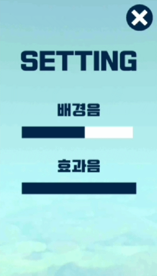
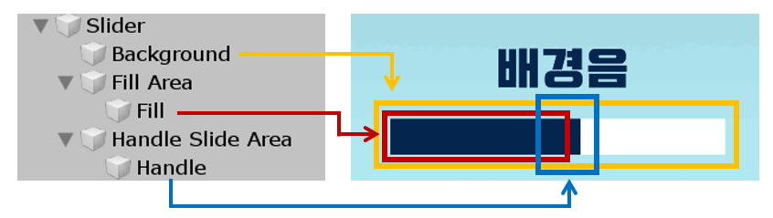
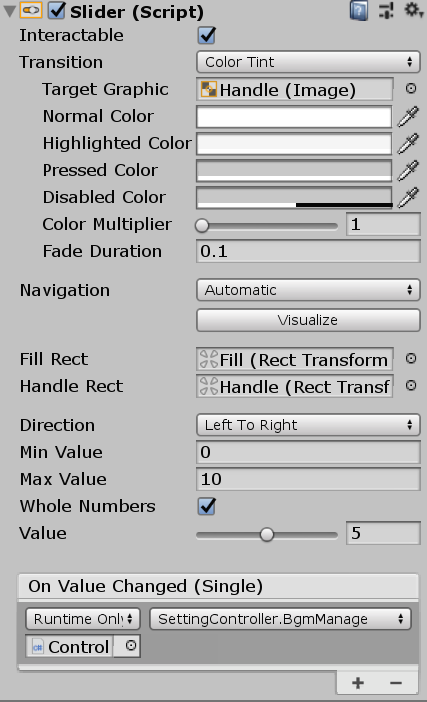
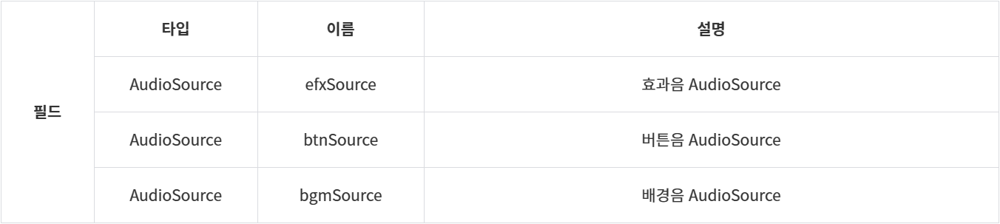

> 아래의 내용은 필자가 게임 개발 프로젝트를 할 때 **구글링하면서 얻었던 것들**을 정리한 글입니다. 잘못된 부분이 있을 시 친절히 알려주시면 감사하겠습니다:)

<br>

모든 게임은 세팅창에서 소리를 조절할 수 있다. 버튼을 눌러서 조절하는 방식도 있지만 주로 **슬라이더**로 조절을 한다. 이 때 슬라이더가 부드럽게(smooth) 움직이는 게 아니라 딱딱 끊어지는 것처럼, **이산적으로(discrete)** 움직인다. 이것을 한 번 구현해보자!

<br>
<div align="center">
    
</div>

## Unity UI - Slider

우선 소리를 조절하기 위한 Slider의 구조부터 살펴보자. Slider는 아래와 같은 3가지 요소로 구성되어 있다.

- **Background** : 슬라이더의 기본 바탕
- **Fill** : 슬라이더의 Handle을 움직일 때 칠해지는 바탕
- **Handle** : 슬라이더의 값을 움직이게 하는 컨트롤러

<br>



<br>

이제 Slider에 있는 Slider Script를 보자. 우리는 Slider Script의 value값을 조절함으로써 Fill이 차지하는 너비를 조절할 수 있다. 참고로 Fill Area는 Fill이 차지할 수 있는 범위를, Handle Slide Area는 Handle이 움직일 수 있는 범위를 뜻한다.

- `Direction` : Slider를 어느 방향에서 어느 방향으로 조절할지 결정할 수 있다.
  - 왼쪽→오른쪽 / 오른쪽→왼쪽 / 아래쪽→위쪽 / 위쪽→아래쪽 중 선택 가능
- `Min Value / Max Value` : Slider의 최소와 최대 값을 설정할 수 있다.
- `Whole Number` : 기본적으로 Slider의 value는 float값이다. Whole Number를 설정하면, int값으로 바꿀 수 있다.
- `Value` : Value의 값에 따라 Slider의 Fill이 차지하는 너비와 Handle의 위치가 바뀐다.
- `OnValueChanged` : 값이 바뀔 때마다 호출할 함수를 지정한다.

<br>



<br>

먼저 어느 쪽 방향으로 Slider를 조절할 것인지 결정한다. 필자의 경우 왼쪽에서 오른쪽으로 이동하면서 값을 올리고 싶어 `Left To Right`로 설정하였다. 그리고 Min Value와 Max Value를 정해준다. 소리를 음소거하고 싶다면 Min Value를 0으로 설정해주어야 한다. 마지막으로 **Whole Number**를 **체크**해준다!

Whole Number를 체크하지 않으면 소리를 이산적으로(discrete) 움직일 수 없다. 만약에 Slider를 움직일 때마다 어떤 음원을 플레이어에게 들려준다면, 매 소수점마다 음원이 재생되어 플레이어에게 울리는 소리가 들린다. 잘 모르겠다면, Whole Number를 꺼보고 소리를 조절해볼 것!

## SoundManager

필자는 배경음/효과음/버튼음을 관리하는 SoundManager를 만들어 소리와 관련된 모든 것을 따로 관리하였다. SoundManager를 구현하는 것이 주가 아니니 간단히 표로 각 요소를 설명하겠다.

참고로 SoundManager를 싱글턴으로 구현하였으며, `DontDestroyOnLoad`하여 Scene이 바뀌어도 파괴되지 않게 하였다.

<br>



<br>


<br>

**AudioSource**는 **음원을 재생하는 라디오**로 보면 되고, **AudioClip**은 **음원인 카세트 테이프**라고 생각하면 된다. 다른 음원을 재생하고 싶다면 AudioClip을 바꾸면 되고, 재생, 정지, 소리 조절을 하고 싶다면 AudioSource의 필드값을 잘 조절하거나 메서드를 호출하면 된다.

## SettingController Script

이제 Slider의 값이 바뀔 때마다 호출할 함수를 짜보자. 먼저 SettingController Script를 생성한다. 그리고 다음과 같이 코드를 짜주면 된다.

```csharp
using System.Collections;
using System.Collections.Generic;
using UnityEngine;
using UnityEngine.UI;

public class SettingController : MonoBehaviour
{
    public SoundManager soundManager;   // SoundManager 인스턴스

    public Slider bgmSlider;    // bgmSource를 조절하는 slider
    public Slider efxSlider;    // efxSource를 조절하는 slider

    // 필요한 audioclip
    public AudioClip exClip;
    public AudioClip exitSound;

    void Start()
    {
        gameManager = GameManager.instance;
        soundManager = SoundManager.instance;

        // slider의 값을 현재 audiosource의 volume크기와 일치시킨다
        bgmSlider.value = (int)(soundManager.bgmSource.volume * 10);
        efxSlider.value = (int)(soundManager.efxSource.volume * 10);
    }

    /// <summary>
    /// bgm 슬라이더 바를 조절
    /// </summary>
    public void BgmManage()
    {
        soundManager.bgmSource.volume = bgmSlider.value * 0.1f;
    }

    /// <summary>
    /// efx 슬라이더 바를 조절
    /// </summary>
    public void EfxManage()
    {
        soundManager.efxSource.volume = efxSlider.value * 0.1f;
        soundManager.PlaySingleForEfx(exClip);
    }
}
```

여기서 주의할 점은 AudioSource의 volume의 범위와 Slider의 value의 범위가 다르다는 것이다. **AudioSource의 volume**은 `float`형이고, 범위가 `0.0 ~ 1.0`인 반면, **Slider의 value**는 (우리가 설정한 바로) `int`형이고, 범위가 `0 ~ 10`이다. 그러므로 상황에 따라 형변환을 꼭 시켜줘야 한다.

우선 Start 함수부터 보자. 여기서 해야할 일은 Slider의 value에 현재 AudioSource의 volume값을 반영하는 것이다. 하지만, 형태도 다르고 범위도 다르므로, 형태와 범위를 일치시켜야 한다. 먼저 **volume \* 10** 을 하여 범위를 `0.0 ~ 10.0`으로 바꿔준다. 그 다음 Slider의 value가 int형이므로 int로 강제 형변환을 시켜준다.

이제 **Slider의 값이 변경될 때마다** 호출되는 함수를 보자! 그렇게 어렵지 않다. value의 범위가 0 ~ 10이므로 **\* 0.1f**를 해주어 범위를 `0.0 ~ 1.0`으로 바꿔주고, float형 상수를 곱했으므로, float형으로 자동형변환이 일어난다.

마지막으로 함수를 Slider의 OnValueChanged에 연결해주면, Slider의 값에 따라 음원의 volume이 이산적으로 조절되는 것을 볼 수 있을 것이다!
